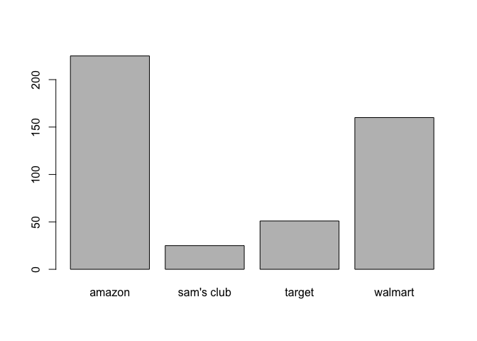
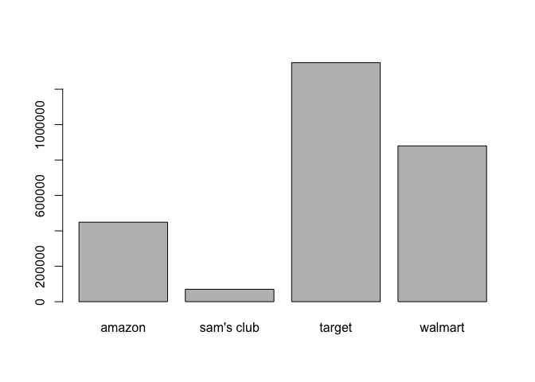
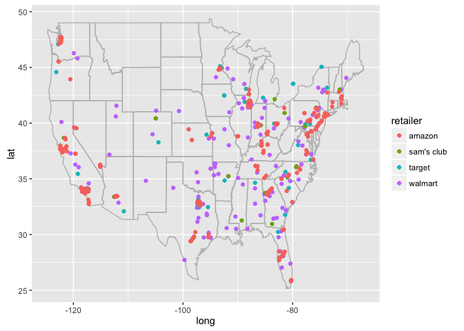
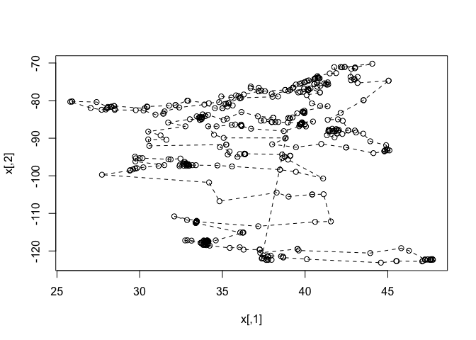
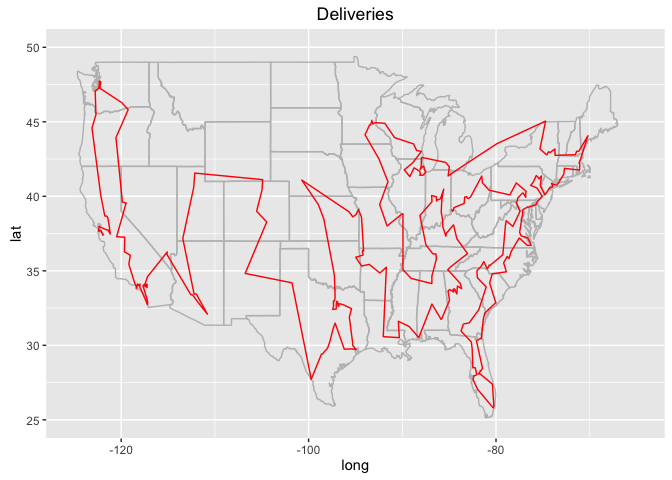
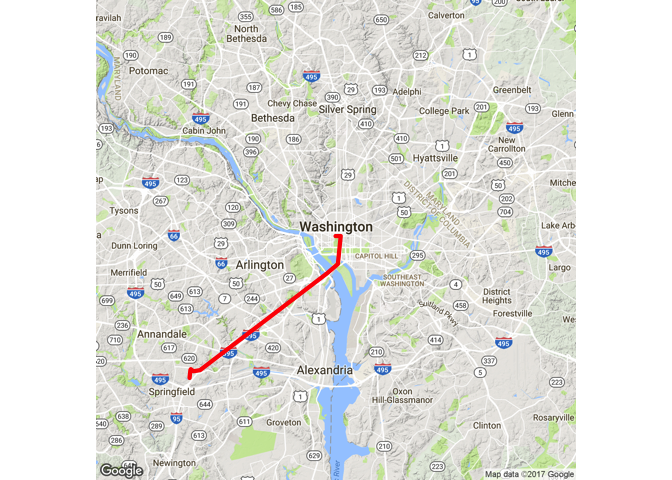

Even though the Christmas season has come and gone, consumers across
America look back fondly on new presents and memories shared with
family. As American retailers report Christmas sales, we take a look
into their distribution networks, a hidden yet vitally important piece
in the complex network that allows customers to recieve their gifts
during the holidays.

In 2015, Amazon reported 107 Billion, Walmart 482 Billion, and Target 74
Billion USD in revenue. Such large sales figures can only be supported
by an extensive logistics network that can efficiently transport large
volumes of product from manufacturer to customer.

In this post, we assume that Santa and his reindeer must visit each of
Amazon's, Walmart's, and Target's warehouses to distribute Christmas
presents to all of America. We will first conduct some exploratory data
analysis on the warehouses in the dataset, then plot the most efficient
route to all of the warehouses and finally show what is the quickest way
for each consumer to pick up his or her packages.

Setup
=====

We first begin by loading a number of packages to visualize geospatial
data. The popular ggplot2 package contains a number of extensions that
allow it to display coordinates on a map background. The TSP package
allows for a user to input a set of GPS coordinates and then calculates
the most effieicnt route that passes through all of the points. By
minimizing distance, delivery companies (such as Rudolph Inc.) do not
waste extra time by travelling across a suboptimal route. The SP package
will allow us to calculate the fastest route from our location to the
nearest warehouse. Finally, the Leaflet package allows us to convert our
visualization into an interactive HTML file where we can explore the
dataset.

    library(ggplot2)
    library(ggmap)
    library(maps)
    library(TSP)
    library(sp)
    library(leaflet)
    options(digits = 15)
    set.seed(2017)

The dataset used for the analysis can be found
[here](https://www.dropbox.com/s/ak89997tj3tox56/warehouse_stats_w_latlon.csv).
We load the data using the read.csv module to convert the values into an
R dataframe. While examining the data we notice that the square foot
attribute should be a number but is read as a factor. Therefore, we
convert it into a numeric value.

    warehouses <- read.csv('warehouse_stats_w_latlon.csv')

    warehouses$sq_ft <- as.numeric(as.character(warehouses$sq_ft))

Exploratory Data Analysis
=========================

The first thing when encountered with a new dataset is to perform some
exploratory data analysis. We start by viewing the first 5 rows of the
dataset. We see that it contains attributes for the retailer that owns
the warehouse, the type of warehouse, and the warehouse address. The
dataset also contains the facility's size and opening date. Finally, we
convert the address into a latitude and longitude coordinate pair.
However, this was hard to obtain for certain warehouses so their
latitude and logitude values are NA.

    head(warehouses,5)

    ##   retailer                type company_id
    ## 1   target general merchandise      T-580
    ## 2   target general merchandise      T-588
    ## 3   target general merchandise     T-0553
    ## 4   target general merchandise     T-0555
    ## 5   target general merchandise     T-0593
    ##                                                location
    ## 1           6175 Greenbrier Rd, Madison, Alabama, 35756
    ## 2                25 N 75th Ave, Phoenix, Arizona, 85043
    ## 3       14750 Miller Avenue, Fontana, California, 92336
    ## 4 2050 East Beamer Street, Woodland, California, 957776
    ## 5          3880 Zachary Ave, Shafter, California, 93263
    ##                    country   sq_ft yr_open         lat           lon
    ## 1 United States of America 1357500    2000 34.64499950  -86.84391439
    ## 2 United States of America 1530700    2002 33.44837487 -112.22108920
    ## 3 United States of America 1423000    1987 34.11206400 -117.48052900
    ## 4 United States of America 1862000    1988          NA            NA
    ## 5 United States of America 2100000    2003 35.44491959 -119.18513490

Since we have data for multiple retailers, we would like to see whether
the companies have similar distribution strategies. By using a table to
calculate frequencies and then converting the aggregated counts into a
barchart, we can see that Amazon has more warehouses than Walmart. Even
though Walmart has revenues that are over 4x greater than those of
Amazon, the online retailer has many more facilities. We hypothesize
that Walmart's warehouses are larger whereas Amazon has many more small
warehouses to ensure fast delivery.

    barplot(table(warehouses$retailer))

We explore the above hypothesis by finding the average warehouse size
for each retailer. To aggregate data, R has a function called tapply
that can group data and return summary statistics. We are only
interested in the median warehosue size, but the function can return an
array of summary statistics.

As we predicted, Amazon's warehouses are about half of the size of
Walmart's warehouses. Interestingly, Target has even larger warehouses
than Walmart. Clearly, the companies have differing priorities with
regards to distribution networks.

    barplot(tapply(warehouses$sq_ft, warehouses$retailer, median, na.rm = TRUE))

We can also break the data into each specific type of warehouse for each
retailer. The table below returns the median warehouse size. Amazon has
extremely small Prime Now and Delivery Sort warehouses in order to
deliver exceptionally small leadtimes to its customers. Prime Now
promises same day delivery for customers, a tactic that is only possible
with small warehouses located close to population centers.

Additionally, Amazon's general merchandise warehouses are significantly
smaller than Walmart and Target's warehouses. This is primarily because
Amazon stocks goods closer to population centers in order to achieve
faster lead times. In contrast, Walmart and Target do not have stores in
all areas and have a lead time buffer in terms of their stores. Amazon
in contrast ships directly to customers so it must place its warehouses
closer to customers.

    aggregate(warehouses$sq_ft, by = list(warehouses$retailer, warehouses$type), FUN = median, na.rm = TRUE)

    ##       Group.1             Group.2       x
    ## 1      target              closed 1225000
    ## 2     walmart              closed  414000
    ## 3      amazon       delivery sort   64000
    ## 4     walmart    domestic-inbound  104380
    ## 5      target          e-commerce  785400
    ## 6     walmart          e-commerce 1001310
    ## 7     walmart              export  191700
    ## 8     walmart             fashion  893700
    ## 9      amazon                food  161400
    ## 10     target                food  430000
    ## 11    walmart                food  875100
    ## 12    walmart            footwear  236100
    ## 13     amazon general merchandise  820400
    ## 14 sam's club general merchandise   70000
    ## 15     target general merchandise 1500000
    ## 16    walmart general merchandise 1200000
    ## 17     target             inbound 1900000
    ## 18    walmart     inbound-foreign 2200000
    ## 19    walmart             optical   38918
    ## 20    walmart            pharmacy   70900
    ## 21     amazon           prime now   36400
    ## 22    walmart         print/photo  390000
    ## 23     target             returns  190000
    ## 24    walmart             returns  222500
    ## 25     amazon                sort  268500
    ## 26    walmart                tire  388560

We also notice that some of the data contains NA for either latitude or
longitude. We need both to calculate distances or plot the warehouses.
The complete.cases function subsets the data so only values with both
latitude and longitude remain.

    complete.latlon <- subset(warehouses, complete.cases(warehouses$lat) == TRUE)

Plotting Data on a Map
======================

We wish to get a visual representation of the geospatial distribution of
our data. By plotting the warehouses on a map of the United States, we
can identify patterns in location.

First, plot the map baselayer that contains outlines of each of the
states, and then add points to represent each warehouse. Finally, group
the 4 retailers by color and add a legend to identify which color
corresponds to which retailer.

For each retailer, we notice that there exist dense clusters on both the
East and West coasts. Walmart tends to place a warehouse on the
outskirts of each larger city in the US. Amazon targets only the largest
of cities and places many smaller warehouses within each city, ensuring
efficient deliveries. While Walmart's warehouses are relatively evenly
distributed according to the United States population, Amazon is
clustered only in the largest cities. We also see that no warehouses for
any retailer exist in Idaho, Montana, or the Dakotas. These areas are
sparsely populated with large distances so retailers choose to serve
them through farther warehouses.

    state.map <- map_data("state")
    ggplot() + geom_polygon(data = state.map, aes(x=long,y=lat,group=group),
                            colour = "grey", fill = NA) +
      geom_point(data = complete.latlon, aes(x = lon, y = lat, color = retailer))

Travelling Salesman (Santa) Problem
===================================

To visit each of the warehouses in the United States, it is critical
that Santa take the most efficient route. By using the ETSP funciton in
the TSP package, we can calculate the shortest route. The function
requires a matrix of X/Y coordinates. We can use the Euclidian distance
("as the crow flies") to travel between each warehouse.

The solve\_TSP function applies a set of heuristics to solve the
Travelling Salesman problem. The two\_opt method seeks to minimize
backtracking or path crossing.

    latlon.m <- ETSP(cbind(complete.latlon$lat, complete.latlon$lon))

    tour <- solve_TSP(latlon.m, method = "two_opt")

By plotting the most efficient tour, we can see the route that Santa
would take to deliver packages to all warehouses in the United States.
However, without a background of the United States, the entire plot does
not make much sense.

    plot(latlon.m, tour)

When we examine the order of the warehouses in the Traveling Salesman
Tour, we convert the tour order into integers and then view the
warehouses corresponding to the index. By calling the index, we see that
the tour starts in Texas, winding around Fort Worth.

    route.order <- (as.integer(tour))
    complete.latlon[route.order[1:6],4]

    ## [1] 222 Commercial Street, Sunnyvale, California,  94085-4508    
    ## [2] 1700 Montague Expy, San Jose, California,  95131             
    ## [3] 38811 Cherry Street, Newark, California,  94560-4939         
    ## [4] 990 Beecher St, San Leandro, California,  94577              
    ## [5] 250 Utah Avenue, South San Francisco, California,  94080-6801
    ## [6] 888 Tennessee Street, San Francisco, California,  94112      
    ## 451 Levels: 1 Centerpoint Blvd, New Castle. Delaware. USA. 19720 ...

Now that there is a solution to the shortest path that passes through
each warehouse, we reorder the dataframe to be in the same order as the
tour. We sequence each of the indeces in the tour and match them to the
row index. Since the values of the indeces will now match, the dataframe
is in the order of the efficient delivery.

    complete.latlon$index <- seq(1, nrow(complete.latlon))
    complete.latlon <- complete.latlon[match(route.order, complete.latlon$index),]

As we saw above, the plot of the tour itself was confusing and just
looked like a bunch of lines that zig-zagged across a plane. To fix this
issue, we want to plot the Traveling Salesman Tour on a map of the
United States. First, we load the geospatial coordinates to map the
state boundaries. We overlay the state data as polygons to create a
blank map of the continental United States. Finally, we overlay the path
created by the Travelling Saleman on top of the states. We only plot
those points that are located inside our viewable area, that is the
Lower 48.

We can now see that the optimal route starts in Texas, winds its way
across the South, then works up the East Coast, then across the midwest.
After that, the route cuts across the center of the country before
winding up the West Coast and finally finishing in Nevada. This route
makes visual and intuitive sense because it does not contain any crosses
or overlaps.

    state.map <- map_data("state")
    ggplot() + geom_polygon(data = state.map, aes(x=long,y=lat,group=group),
                            colour = "grey", fill = NA) +
                            geom_path(data=complete.latlon, 
                                      aes(x=lon, y=lat), col="red") +
                                      xlim(-125,-65) + ylim(25,50) +
                                      ggtitle("Deliveries")

Now that all of the packages have been delivered to a warehouse, we wish
to know what is the closest facility to pick up the gifts. We need to
first geocode a given address by converting it into latitude and
longitude coordinates. By using the geocode function, we can convert the
text into GPS using the Google Maps API. (Note: Google Maps API is
limited to 2500 calls per day.) The location returns a latitude and
longitude pair.

    my.loc <- "1600 Pennsylvania Ave. Washington DC"
    loc.coords <- geocode(my.loc)
    loc.coords

    ##           lon        lat
    ## 1 -77.0365298 38.8976763

For our Warehouse data, we make use of the Spatial Points library to
note that the latitude and longitude values are not independent points
but rather a coordinate pair. By passing the SpatialPoints function a
dataframe of coordinate pairs in longitude/latitude format, we now have
a set of GPS points we can use to calculate great circle distances.
Distances over large scales are not the typical x/y coordinate Euclidian
distance. Because Earth is a sphere, the shortest distance between
points looks like an arc when plotted on a 2 dimensional surface such as
a map or screen. These routes are called great circles and the
coordinate system WGS84 is used to calculate great circle distances.

By using the function spDists, we can calcuate the distance from our
specified point to any of the warehouses. We append this distance onto
the warehouse dataframe. Because we specify longlat to be True, the
function calculates Great Circle distance instead of euclidian straight
line distance. The distance column of the complete.latlon data now
contains the separation between The White House and each individual
warehouse.

Finally, we return the index of the minimum distance of all of the
computed distances to display the closest warehouse to the White House.

    warehouses.coords <- SpatialPoints(coords = data.frame(lon = complete.latlon$lon, lat = complete.latlon$lat), proj4string = CRS("+proj=longlat +datum=WGS84"))

    my.coords <- SpatialPoints(coords = data.frame(loc.coords), proj4string = CRS("+proj=longlat +datum=WGS84"))

    complete.latlon$distance <- spDists(warehouses.coords, my.coords, longlat = T)

    closest.warehouse <- complete.latlon[which.min(complete.latlon$distance),]

    closest.warehouse

    ##     retailer      type company_id
    ## 453   amazon prime now       UVA1
    ##                                                             location
    ## 453 5617 Industrial Dr, Suite A, Springfield, Virginia,  22151- 4410
    ##                      country  sq_ft yr_open         lat         lon index
    ## 453 United States of America 126900    2015 38.79845428 -77.1696701   441
    ##            distance
    ## 453 15.966158074277

Santa could directly fly the 16 kilometers between the White House and
the Amazon Food warehouse that is closest. However, for the President to
access the location he would need his Secret Service to drive.
Fortunately, ggmap contains the route function that takes two locations,
the start and end points, and returns the Google Maps routing between
the points. Route returns a dataframe that contains the latitude and
longitude coordinates of each of the turns required to travel from point
A to point B (White House to warehouse).

Once we have our routing information, we display it on a map to visulize
the President's journey to pick up his or her package. By adding a
geom\_path layer to the map, we can visualize the routing via the order
of the coordinates in the route.

    warehouse.address <- as.character(closest.warehouse$location)

    route.df <- route(my.loc, warehouse.address, structure = 'route')

    qmap(my.loc, zoom = 11) + geom_path(data = route.df, aes(x = lon, y = lat), color = "red", size = 1.5, lineend = "round")

Finally, we use the Leaflet package to transform our static geospatial
visualization created earlier into an interactive map. We first add our
latitude and longitude dataframe and the map images onto the map. We
color each warehouse by its retailer, so that Orange refers to Amazon,
Blue refers to Walmart, Green refers to Sam's Club, and Red refers to
Target. Afterwards, for each warehouse marker on our map, we add a popup
that displays its status. Therefore, we can interactively view each
facility's function, owner, and size. It is extremely easy to see where
warehouse clusters are located, especially those within large cities in
America.

    dynamic.map <- leaflet(complete.latlon)
    dynamic.map <- addTiles(dynamic.map)

    pal <- colorFactor(c('orange','green','red','blue'), domain = complete.latlon$retailer)

    dynamic.map <- addCircleMarkers(dynamic.map, 
                                    popup = paste("Retailer:", complete.latlon$retailer," ",
                                                  'Type:', complete.latlon$type, ' ',
                                                  'Square Feet:', complete.latlon$sq_ft, ' ',
                                                  'Opened:', complete.latlon$yr_open,' ',
                                                  'Address:',complete.latlon$location,' ',
                                                  'Distance from the White House:', round(complete.latlon$distance,3), 'km'),
                                    color = ~pal(retailer), stroke = FALSE, fillOpacity = 0.7)

    dynamic.map

<!--html_preserve-->

<script type="application/json" data-for="htmlwidget-cf0384010b90a98185a5">{"x":{"calls":[{"method":"addTiles","args":["http://{s}.tile.openstreetmap.org/{z}/{x}/{y}.png",null,null,{"minZoom":0,"maxZoom":18,"maxNativeZoom":null,"tileSize":256,"subdomains":"abc","errorTileUrl":"","tms":false,"continuousWorld":false,"noWrap":false,"zoomOffset":0,"zoomReverse":false,"opacity":1,"zIndex":null,"unloadInvisibleTiles":null,"updateWhenIdle":null,"detectRetina":false,"reuseTiles":false,"attribution":"&copy; <a href=\"http://openstreetmap.org\">OpenStreetMap\u003c/a> contributors, <a href=\"http://creativecommons.org/licenses/by-sa/2.0/\">CC-BY-SA\u003c/a>"}]},{"method":"addCircleMarkers","args":[[37.37840271,37.40308762,37.51973343,37.72068787,37.64647293,37.76063137,37.97137833,37.74240875,37.74566269,37.74566269,37.46884324,37.9180069,38.54679489,38.67112732,38.67990494,40.10584965,44.5801239,45.51179123,45.53874046,47.0815239,47.11262131,47.2518158,47.54304998,47.57727051,47.58581311,47.61683273,47.728054,47.705379,47.62256674,47.4195604,47.41388083,47.24265289,46.27877045,45.81106447,43.93881226,39.6124115,39.5494663,39.537708,37.28826141,37.25510025,37.25510025,37.25510025,36.28092957,36.0459671,35.44491959,34.23420645,34.03272629,33.96214676,33.83060837,33.8517724,33.91869736,34.09181976,34.11740875,34.00526784,34.11128616,33.88004684,33.74958038,33.6903038,33.68788147,32.74994278,32.88198853,33.13138962,33.96850213,34.0534725,34.04602051,34.04602051,34.01671219,34.01229095,34.01052475,34.01247406,34.01590729,34.01599884,34.02440262,34.072727,34.112064,34.05055618,33.93284988,34.01250458,34.02901077,34.00297165,33.93786621,33.87011535,33.8682251,34.07572937,34.09033203,34.09033203,34.08818054,34.08449936,34.11080933,34.12850529,34.15308103,34.15272903,34.59734344,36.23797226,36.26928024,36.228694,36.0759201,33.3880043,33.3880043,33.41204071,32.86489105,32.08920288,33.44130658,33.45404053,33.43011475,33.43321609,33.44340134,33.44837487,33.45700836,33.45700836,37.16911979,40.60549164,41.55830272,41.1199913,40.42881,40.42881012,38.99854279,38.2795372,34.82611465,34.19462204,27.71946341,29.40797043,29.42457962,29.59712774,29.73512459,29.73512459,29.83211003,30.2200985,31.144451,31.49033928,29.74129982,29.75804329,29.71563242,30.00127494,30.16754039,31.74209213,31.87180519,32.46493556,32.73051453,32.78852463,32.77814865,32.65597321,32.64923859,32.633358,32.622161,32.81828308,32.9143028,32.95799637,32.95497894,32.91731291,32.85503006,32.81837845,32.43489075,32.407485,32.668697,32.82837296,32.97071457,32.99388123,32.96910858,32.970066,33.18693392,33.39661159,34.70013499,35.58269501,38.48472595,38.48472595,39.44325638,41.09014995,38.96431491,38.61915207,38.77216721,39.11210251,39.09302139,38.61112976,36.35267639,36.33348083,36.35992432,36.36664581,36.36559677,36.36025272,36.35857773,36.36022188,36.36764087,36.3781929,36.36664963,36.32155991,36.05464585,35.91136169,35.3208,35.43241359,34.85473251,35.22402272,35.24054337,30.58095865,30.51451631,31.613824,31.26418686,30.5179,32.76654434,31.72030538,33.03390503,33.63844681,33.63844681,33.74566689,33.61582184,33.57589513,33.64346695,33.74882586,33.79213715,33.74831009,33.66400909,33.44818497,33.97599792,33.80782507,34.13370895,35.07612991,35.28287506,36.15398788,37.14321899,38.07781599,38.07469559,37.52723312,37.32605986,37.97462404,37.97999315,37.9840339,38.19809563,38.37905154,38.95601654,39.81114578,40.47694016,39.83179092,39.81755829,39.76691055,39.768615,39.74670792,39.72114944,39.67516327,39.700435,39.69480515,39.74161148,39.96574447,39.97857347,40.05073166,39.64176245,38.71059418,36.7348175,36.16783905,36.13019562,36.1309166,36.13056946,35.77748489,35.56541443,34.6449995,34.14238572,34.49154161,35.078022,38.83188248,38.79133925,38.01033095,39.44658883,40.977725,42.47648621,42.48106766,44.12759781,44.79749389,44.78850937,44.8064537,45.09867096,44.98210162,44.853374,44.9454422,44.89780045,43.93996015,43.51396561,43.07913589,43.01174927,42.25069046,41.77968487,41.31980896,41.91262521,41.67219543,41.48566818,41.48105979,41.40557706,41.42576599,41.42839126,41.63934633,41.83996201,41.88425064,41.90364456,42.03141022,41.803295,41.98699951,42.60681108,42.61226133,42.27784729,41.98560007,41.36657439,42.1497612,43.5352652,43.5352652,45.04797,45.04797,43.17313766,42.77457047,42.98913574,42.98720169,42.93460786,43.179019,42.74739838,42.79281221,43.0158446,43.02552536,44.06219043,42.39376068,42.39433117,42.23316327,42.14894485,41.75883102,41.87647372,41.49078816,40.74793625,40.7820015,40.7820015,40.87866974,40.83398438,40.74919891,40.63266754,40.56445643,40.59336528,40.58503342,40.58513895,40.22016907,40.10806985,40.73141456,41.36846535,41.16779052,41.26403354,41.39582053,41.31594703,40.92230606,40.73660128,40.55628967,40.55769257,39.99529704,39.95227814,39.77508232,39.663902,39.43867111,39.26754761,39.27175976,39.29058075,39.10181768,38.79845428,38.79845428,37.57730708,37.35132962,37.35132962,37.198322,36.71429062,36.70747757,37.19585037,37.19511911,36.29383586,35.82393265,35.96364594,35.53934479,34.93288502,34.80149031,34.179306,32.924789,32.87672043,32.17382813,32.159584,31.77520561,30.43309852,30.46714514,30.29337311,28.45963478,28.45478058,28.30277061,28.30014992,28.25149727,28.07566261,28.073276,27.3935318,25.917249,25.90579224,25.80333687,27.04011536,27.69631386,27.95224953,28.02031517,28.49736977,28.49308777,29.76182476,30.23220442,30.95488071,31.42775215,31.43824959,31.502794,32.39143834,33.91062927,34.54901123,35.00188065,35.00870034,35.3071785,35.62177658,35.1296284,35.22710419,35.39052889,35.35213575,36.050279,36.050279,36.13056183,38.02953339,38.36468887,37.98262405,38.98669124,39.58707809,39.71502766,39.89291847,40.17240143,40.17534256,40.18899155,40.22678757,39.93283081,40.16947299,40.32524872,40.89651108,40.89651108,40.09368315,40.41030787,40.91194153,41.35897827,39.95681539,39.84202576,39.8875885,39.896869,39.97127533,39.95128669,39.94981766,39.52074923,39.24153137,38.98320571,39.06285477,39.08734512,39.07458496],[-122.0076981,-121.8983765,-122.0154572,-122.1842117,-122.3967896,-122.3895769,-122.3551712,-121.5316162,-121.4060287,-121.4060287,-121.1643981,-121.2510071,-121.4175034,-121.5257416,-121.7457199,-122.1875402,-123.1146774,-122.6756287,-122.6968414,-122.7728577,-122.6400223,-122.393898,-122.3281261,-122.3373566,-122.3259039,-122.3390808,-122.345764,-122.18264,-122.1751095,-122.2612111,-122.2545062,-122.2439041,-119.9207382,-119.251336,-120.5585938,-119.8670425,-119.4539568,-119.47602,-120.488533,-119.6175232,-119.6175232,-119.6175232,-119.6532898,-119.0195618,-119.1851349,-118.5842706,-118.4498291,-118.3723068,-118.3839264,-118.31771,-118.3248444,-118.2694244,-118.2508545,-118.147322,-117.9918137,-118.0072021,-117.8742981,-117.8457642,-117.8475189,-117.2012863,-117.1601486,-117.2561569,-117.6576311,-117.6320133,-117.5717316,-117.5717316,-117.5545807,-117.5544052,-117.55439,-117.5441666,-117.543045,-117.5451813,-117.5456009,-117.512977,-117.480529,-117.4549789,-117.4425735,-117.3811798,-117.3322906,-117.3325958,-117.2973785,-117.2433928,-117.2370529,-117.2283554,-117.2401962,-117.2401962,-117.2460022,-117.2637329,-117.3803101,-117.422624,-117.4315853,-117.4262238,-117.1975861,-115.122139,-115.07987,-115.105308,-115.0951157,-112.5579224,-112.5579224,-112.4217987,-111.7703171,-110.7978516,-111.9784793,-112.0738525,-112.193512,-112.2066193,-112.2195435,-112.2210892,-112.2253647,-112.2253647,-113.4233236,-112.2565079,-112.1441909,-104.8998871,-104.968482,-104.968483,-105.5478134,-104.4673309,-106.7698212,-101.7744064,-99.71860819,-98.6267395,-98.49461365,-98.29317905,-98.06399536,-98.06399536,-97.96341687,-97.74904633,-97.364006,-97.16565704,-96.19430959,-95.36141205,-94.91143718,-95.30241944,-95.30000277,-95.61906433,-95.65638733,-95.41824929,-96.3343277,-96.67424774,-96.79540253,-96.74945176,-96.75668335,-96.79886627,-96.836921,-96.89147186,-96.90002829,-97.01693726,-97.02039337,-96.98073126,-96.97759247,-97.04308319,-97.05619812,-97.426528,-97.324783,-97.35449219,-97.33527374,-97.30268097,-97.28874969,-97.250015,-97.17337623,-97.17625022,-97.24772036,-97.50861359,-98.38017273,-98.38017273,-98.95733643,-100.727159,-95.69550924,-95.27883911,-94.94548035,-94.68661499,-94.67440796,-94.35575104,-94.12863159,-94.12471008,-94.18238831,-94.18480682,-94.18887329,-94.19280633,-94.194664,-94.19666201,-94.19648364,-94.22254944,-94.21923828,-94.25616455,-94.19160001,-94.97267151,-94.344627,-93.52949739,-92.3946991,-91.7293556,-91.70126343,-92.03240834,-90.32036439,-90.420204,-89.26797485,-88.242376,-86.84028625,-85.83729543,-84.95891571,-85.12020111,-85.12020111,-84.94631186,-84.59880829,-84.53887627,-84.50001526,-84.59008969,-84.44793701,-84.39111328,-84.34317017,-84.18470001,-84.11444092,-83.67588088,-83.79026794,-85.15158844,-84.8131485,-83.03527069,-84.17465973,-84.53165241,-84.54927063,-85.28762054,-85.35279728,-85.68337351,-85.68525307,-85.68722114,-85.69172725,-85.69092259,-85.84926605,-85.7765274,-85.5820694,-85.92910004,-86.02503967,-86.14996338,-86.295372,-86.29574585,-86.32675934,-86.32415771,-86.342849,-86.35845184,-86.34844208,-86.38152838,-86.38423003,-86.87097168,-86.8317204,-88.12199402,-87.47741699,-86.7781601,-86.69237518,-86.40607452,-86.40444946,-86.36366272,-86.46109009,-86.84391439,-86.8459864,-89.06369448,-89.92764282,-89.93251038,-90.08177653,-91.62312604,-92.41768956,-91.528022,-92.47128296,-92.47042084,-93.97535706,-93.48785944,-93.44298553,-93.36429596,-93.24638367,-93.2151901,-93.136138,-92.91287231,-91.85990906,-90.8290118,-88.79357147,-88.4768219,-87.96323395,-88.88376617,-89.79052886,-89.19985962,-88.74066465,-88.1155014,-88.0802002,-88.07099886,-88.13120104,-87.77007294,-87.74761766,-87.49666616,-87.68299866,-87.63244629,-87.65280151,-87.77781677,-88.097259,-87.98768616,-87.95153663,-87.94414915,-85.38256073,-84.98004533,-85.11051536,-83.26625061,-79.8903028,-79.8903028,-74.70932,-74.70932,-75.31317139,-74.58434296,-74.40527344,-74.39250183,-74.24039327,-73.718132,-73.69259644,-71.52822398,-71.40033893,-71.1665985,-70.19020334,-71.03237152,-71.05556779,-71.13987833,-71.06182098,-71.09461975,-72.69646347,-72.76265636,-73.49291992,-73.83170319,-73.83170319,-74.07634735,-74.05044556,-73.98519897,-73.96692657,-74.22407269,-74.22606893,-74.2547226,-74.26098056,-74.63337708,-74.79728691,-75.27639113,-75.1516825,-75.40476099,-75.49965017,-75.70223875,-75.76305784,-76.04891205,-76.30917236,-75.62169647,-75.61895549,-75.07731289,-75.1624527,-75.37987679,-75.59027,-75.73313904,-76.54810333,-76.55126318,-76.60926056,-77.14175418,-77.1696701,-77.1696701,-77.48223178,-77.32397608,-77.32397608,-76.59999,-76.24784088,-76.66335297,-77.50269318,-77.53369264,-78.38238381,-78.61334229,-78.80236816,-79.18541718,-78.89790908,-80.40986225,-80.679016,-80.059669,-80.00927734,-81.17550659,-81.195968,-81.35263824,-81.57535382,-81.67237937,-82.08572388,-81.43952942,-81.44618988,-81.5980072,-81.69245148,-81.66416931,-81.8989563,-81.676582,-80.38800049,-80.226478,-80.25978088,-80.30512065,-81.95446777,-82.44941711,-82.36575317,-82.0531311,-82.21511078,-82.47229004,-82.54183017,-82.63850771,-83.73162523,-83.48449722,-83.44924927,-82.86985,-81.83401532,-81.04978943,-81.99890137,-82.03803253,-82.02914268,-81.57785797,-81.30474854,-80.93153648,-80.84321594,-80.71871728,-80.6582395,-79.328786,-79.328786,-79.26565552,-78.99951935,-78.91730499,-78.20178223,-77.43954375,-77.82892609,-77.72141039,-77.67080516,-77.23470306,-77.23203278,-77.2264328,-77.11352539,-76.82025909,-76.84068628,-76.77259064,-77.83875275,-77.83875275,-78.52418482,-80.73916376,-81.45695496,-81.52348328,-82.7117984,-82.93731689,-83.04450989,-83.101959,-83.10050201,-83.34030099,-83.34776306,-83.3952447,-84.48200989,-84.62712966,-84.71887207,-84.72550964,-84.71832275],10,null,null,{"lineCap":null,"lineJoin":null,"clickable":true,"pointerEvents":null,"className":"","stroke":false,"color":["#FFA500","#FFA500","#FFA500","#FFA500","#FFA500","#FFA500","#FFA500","#FFA500","#FFA500","#FFA500","#FFA500","#FFA500","#FFA500","#FFA500","#00FF00","#0000FF","#FF0000","#FFA500","#FFA500","#FF0000","#FFA500","#00FF00","#FFA500","#FFA500","#FFA500","#FFA500","#FFA500","#FFA500","#FFA500","#FFA500","#FFA500","#FFA500","#0000FF","#0000FF","#FFA500","#FFA500","#FFA500","#0000FF","#0000FF","#FFA500","#FFA500","#0000FF","#0000FF","#0000FF","#FF0000","#FFA500","#FFA500","#FFA500","#FFA500","#0000FF","#FFA500","#FFA500","#FFA500","#FFA500","#0000FF","#FFA500","#FFA500","#FFA500","#FFA500","#FFA500","#FFA500","#FFA500","#0000FF","#00FF00","#FF0000","#FF0000","#0000FF","#0000FF","#0000FF","#0000FF","#0000FF","#0000FF","#0000FF","#0000FF","#FF0000","#0000FF","#FFA500","#0000FF","#0000FF","#0000FF","#FFA500","#FFA500","#FFA500","#FFA500","#FFA500","#FFA500","#FFA500","#FFA500","#FF0000","#FFA500","#FF0000","#FF0000","#0000FF","#0000FF","#FFA500","#FFA500","#FFA500","#00FF00","#0000FF","#FFA500","#0000FF","#FF0000","#FFA500","#FFA500","#FFA500","#FFA500","#FF0000","#FF0000","#FFA500","#FFA500","#0000FF","#0000FF","#0000FF","#0000FF","#00FF00","#0000FF","#0000FF","#FF0000","#0000FF","#0000FF","#0000FF","#FFA500","#FFA500","#FFA500","#00FF00","#0000FF","#FFA500","#FFA500","#0000FF","#0000FF","#0000FF","#FFA500","#0000FF","#FFA500","#0000FF","#0000FF","#0000FF","#FF0000","#0000FF","#0000FF","#FFA500","#FFA500","#0000FF","#FFA500","#00FF00","#0000FF","#FFA500","#FFA500","#FFA500","#FFA500","#FFA500","#FFA500","#FF0000","#0000FF","#FF0000","#FFA500","#FFA500","#FFA500","#0000FF","#0000FF","#FF0000","#0000FF","#0000FF","#0000FF","#FFA500","#FFA500","#FFA500","#0000FF","#FF0000","#0000FF","#FFA500","#FFA500","#00FF00","#0000FF","#0000FF","#0000FF","#0000FF","#0000FF","#0000FF","#0000FF","#0000FF","#0000FF","#0000FF","#0000FF","#0000FF","#0000FF","#0000FF","#0000FF","#0000FF","#0000FF","#FF0000","#0000FF","#00FF00","#0000FF","#0000FF","#0000FF","#00FF00","#0000FF","#0000FF","#0000FF","#0000FF","#0000FF","#0000FF","#00FF00","#0000FF","#FFA500","#FFA500","#FFA500","#FFA500","#FFA500","#0000FF","#0000FF","#FFA500","#0000FF","#FFA500","#FFA500","#FFA500","#0000FF","#0000FF","#FFA500","#FFA500","#FFA500","#FFA500","#FFA500","#FFA500","#FFA500","#FFA500","#FFA500","#0000FF","#00FF00","#0000FF","#0000FF","#0000FF","#FFA500","#FF0000","#FF0000","#FFA500","#FFA500","#FFA500","#FFA500","#0000FF","#FFA500","#FFA500","#0000FF","#0000FF","#0000FF","#0000FF","#FFA500","#FFA500","#FFA500","#FFA500","#FFA500","#0000FF","#FF0000","#0000FF","#0000FF","#0000FF","#FFA500","#FFA500","#0000FF","#0000FF","#0000FF","#FF0000","#FF0000","#0000FF","#FFA500","#FFA500","#00FF00","#FF0000","#FFA500","#FFA500","#FF0000","#0000FF","#0000FF","#0000FF","#FF0000","#FFA500","#0000FF","#0000FF","#0000FF","#FF0000","#FFA500","#FFA500","#FFA500","#0000FF","#FFA500","#00FF00","#0000FF","#FFA500","#FFA500","#FFA500","#FFA500","#FFA500","#FFA500","#FFA500","#FFA500","#FF0000","#0000FF","#0000FF","#00FF00","#FF0000","#FF0000","#FF0000","#FF0000","#0000FF","#0000FF","#0000FF","#0000FF","#FF0000","#FF0000","#FFA500","#FFA500","#00FF00","#0000FF","#0000FF","#FFA500","#FFA500","#FFA500","#FFA500","#FFA500","#FFA500","#FFA500","#FFA500","#FFA500","#FFA500","#FFA500","#FFA500","#FFA500","#FFA500","#FFA500","#FFA500","#FFA500","#FFA500","#FFA500","#FFA500","#FFA500","#0000FF","#0000FF","#FFA500","#00FF00","#FFA500","#FFA500","#0000FF","#FFA500","#FFA500","#FFA500","#FFA500","#FFA500","#FFA500","#FFA500","#FFA500","#FFA500","#FFA500","#FFA500","#FFA500","#FFA500","#FFA500","#FFA500","#FFA500","#0000FF","#FFA500","#FF0000","#FFA500","#0000FF","#0000FF","#FFA500","#FFA500","#FFA500","#0000FF","#0000FF","#FF0000","#FFA500","#0000FF","#FF0000","#0000FF","#FF0000","#FFA500","#FFA500","#0000FF","#FFA500","#FFA500","#0000FF","#0000FF","#FFA500","#00FF00","#0000FF","#0000FF","#FFA500","#FFA500","#FFA500","#0000FF","#FFA500","#FFA500","#FFA500","#0000FF","#FFA500","#0000FF","#FF0000","#00FF00","#0000FF","#FF0000","#0000FF","#0000FF","#FFA500","#0000FF","#0000FF","#FFA500","#0000FF","#FF0000","#00FF00","#FFA500","#FFA500","#0000FF","#00FF00","#0000FF","#00FF00","#FF0000","#0000FF","#0000FF","#FFA500","#0000FF","#00FF00","#FF0000","#FFA500","#FFA500","#FFA500","#FFA500","#FF0000","#FFA500","#FFA500","#0000FF","#FFA500","#0000FF","#0000FF","#00FF00","#FFA500","#FFA500","#0000FF","#FFA500","#0000FF","#FFA500","#FF0000","#FF0000","#0000FF","#FFA500","#FFA500","#FFA500","#FFA500","#FFA500"],"weight":5,"opacity":0.5,"fill":true,"fillColor":["#FFA500","#FFA500","#FFA500","#FFA500","#FFA500","#FFA500","#FFA500","#FFA500","#FFA500","#FFA500","#FFA500","#FFA500","#FFA500","#FFA500","#00FF00","#0000FF","#FF0000","#FFA500","#FFA500","#FF0000","#FFA500","#00FF00","#FFA500","#FFA500","#FFA500","#FFA500","#FFA500","#FFA500","#FFA500","#FFA500","#FFA500","#FFA500","#0000FF","#0000FF","#FFA500","#FFA500","#FFA500","#0000FF","#0000FF","#FFA500","#FFA500","#0000FF","#0000FF","#0000FF","#FF0000","#FFA500","#FFA500","#FFA500","#FFA500","#0000FF","#FFA500","#FFA500","#FFA500","#FFA500","#0000FF","#FFA500","#FFA500","#FFA500","#FFA500","#FFA500","#FFA500","#FFA500","#0000FF","#00FF00","#FF0000","#FF0000","#0000FF","#0000FF","#0000FF","#0000FF","#0000FF","#0000FF","#0000FF","#0000FF","#FF0000","#0000FF","#FFA500","#0000FF","#0000FF","#0000FF","#FFA500","#FFA500","#FFA500","#FFA500","#FFA500","#FFA500","#FFA500","#FFA500","#FF0000","#FFA500","#FF0000","#FF0000","#0000FF","#0000FF","#FFA500","#FFA500","#FFA500","#00FF00","#0000FF","#FFA500","#0000FF","#FF0000","#FFA500","#FFA500","#FFA500","#FFA500","#FF0000","#FF0000","#FFA500","#FFA500","#0000FF","#0000FF","#0000FF","#0000FF","#00FF00","#0000FF","#0000FF","#FF0000","#0000FF","#0000FF","#0000FF","#FFA500","#FFA500","#FFA500","#00FF00","#0000FF","#FFA500","#FFA500","#0000FF","#0000FF","#0000FF","#FFA500","#0000FF","#FFA500","#0000FF","#0000FF","#0000FF","#FF0000","#0000FF","#0000FF","#FFA500","#FFA500","#0000FF","#FFA500","#00FF00","#0000FF","#FFA500","#FFA500","#FFA500","#FFA500","#FFA500","#FFA500","#FF0000","#0000FF","#FF0000","#FFA500","#FFA500","#FFA500","#0000FF","#0000FF","#FF0000","#0000FF","#0000FF","#0000FF","#FFA500","#FFA500","#FFA500","#0000FF","#FF0000","#0000FF","#FFA500","#FFA500","#00FF00","#0000FF","#0000FF","#0000FF","#0000FF","#0000FF","#0000FF","#0000FF","#0000FF","#0000FF","#0000FF","#0000FF","#0000FF","#0000FF","#0000FF","#0000FF","#0000FF","#0000FF","#FF0000","#0000FF","#00FF00","#0000FF","#0000FF","#0000FF","#00FF00","#0000FF","#0000FF","#0000FF","#0000FF","#0000FF","#0000FF","#00FF00","#0000FF","#FFA500","#FFA500","#FFA500","#FFA500","#FFA500","#0000FF","#0000FF","#FFA500","#0000FF","#FFA500","#FFA500","#FFA500","#0000FF","#0000FF","#FFA500","#FFA500","#FFA500","#FFA500","#FFA500","#FFA500","#FFA500","#FFA500","#FFA500","#0000FF","#00FF00","#0000FF","#0000FF","#0000FF","#FFA500","#FF0000","#FF0000","#FFA500","#FFA500","#FFA500","#FFA500","#0000FF","#FFA500","#FFA500","#0000FF","#0000FF","#0000FF","#0000FF","#FFA500","#FFA500","#FFA500","#FFA500","#FFA500","#0000FF","#FF0000","#0000FF","#0000FF","#0000FF","#FFA500","#FFA500","#0000FF","#0000FF","#0000FF","#FF0000","#FF0000","#0000FF","#FFA500","#FFA500","#00FF00","#FF0000","#FFA500","#FFA500","#FF0000","#0000FF","#0000FF","#0000FF","#FF0000","#FFA500","#0000FF","#0000FF","#0000FF","#FF0000","#FFA500","#FFA500","#FFA500","#0000FF","#FFA500","#00FF00","#0000FF","#FFA500","#FFA500","#FFA500","#FFA500","#FFA500","#FFA500","#FFA500","#FFA500","#FF0000","#0000FF","#0000FF","#00FF00","#FF0000","#FF0000","#FF0000","#FF0000","#0000FF","#0000FF","#0000FF","#0000FF","#FF0000","#FF0000","#FFA500","#FFA500","#00FF00","#0000FF","#0000FF","#FFA500","#FFA500","#FFA500","#FFA500","#FFA500","#FFA500","#FFA500","#FFA500","#FFA500","#FFA500","#FFA500","#FFA500","#FFA500","#FFA500","#FFA500","#FFA500","#FFA500","#FFA500","#FFA500","#FFA500","#FFA500","#0000FF","#0000FF","#FFA500","#00FF00","#FFA500","#FFA500","#0000FF","#FFA500","#FFA500","#FFA500","#FFA500","#FFA500","#FFA500","#FFA500","#FFA500","#FFA500","#FFA500","#FFA500","#FFA500","#FFA500","#FFA500","#FFA500","#FFA500","#0000FF","#FFA500","#FF0000","#FFA500","#0000FF","#0000FF","#FFA500","#FFA500","#FFA500","#0000FF","#0000FF","#FF0000","#FFA500","#0000FF","#FF0000","#0000FF","#FF0000","#FFA500","#FFA500","#0000FF","#FFA500","#FFA500","#0000FF","#0000FF","#FFA500","#00FF00","#0000FF","#0000FF","#FFA500","#FFA500","#FFA500","#0000FF","#FFA500","#FFA500","#FFA500","#0000FF","#FFA500","#0000FF","#FF0000","#00FF00","#0000FF","#FF0000","#0000FF","#0000FF","#FFA500","#0000FF","#0000FF","#FFA500","#0000FF","#FF0000","#00FF00","#FFA500","#FFA500","#0000FF","#00FF00","#0000FF","#00FF00","#FF0000","#0000FF","#0000FF","#FFA500","#0000FF","#00FF00","#FF0000","#FFA500","#FFA500","#FFA500","#FFA500","#FF0000","#FFA500","#FFA500","#0000FF","#FFA500","#0000FF","#0000FF","#00FF00","#FFA500","#FFA500","#0000FF","#FFA500","#0000FF","#FFA500","#FF0000","#FF0000","#0000FF","#FFA500","#FFA500","#FFA500","#FFA500","#FFA500"],"fillOpacity":0.7,"dashArray":null},null,null,["Retailer: amazon   Type: prime now   Square Feet: 24000   Opened: 2015   Address: 222 Commercial Street, Sunnyvale, California,  94085-4508   Distance from the White House: 3905.826 km","Retailer: amazon   Type: delivery sort   Square Feet: NA   Opened: 2013   Address: 1700 Montague Expy, San Jose, California,  95131   Distance from the White House: 3895.766 km","Retailer: amazon   Type: sort   Square Feet: 574700   Opened: 2014   Address: 38811 Cherry Street, Newark, California,  94560-4939   Distance from the White House: 3902.011 km","Retailer: amazon   Type: delivery sort   Square Feet: NA   Opened: 2013   Address: 990 Beecher St, San Leandro, California,  94577   Distance from the White House: 3910.023 km","Retailer: amazon   Type: delivery sort   Square Feet: 111000   Opened: 2016   Address: 250 Utah Avenue, South San Francisco, California,  94080-6801   Distance from the White House: 3930.334 km","Retailer: amazon   Type: prime now   Square Feet: 39000   Opened: 2015   Address: 888 Tennessee Street, San Francisco, California,  94112   Distance from the White House: 3926.16 km","Retailer: amazon   Type: delivery sort   Square Feet: 224200   Opened: 2016   Address: 6015 Giant Road. Richmond. California,  94080-6801   Distance from the White House: 3916.761 km","Retailer: amazon   Type: general merchandise   Square Feet: 1001400   Opened: 2016   Address: 188 Mountain House Parkway, Tracy, California, USA. 95377- 8906   Distance from the White House: 3854.092 km","Retailer: amazon   Type: general merchandise   Square Feet: 1200000   Opened: 2013   Address: 1555 N. Chrisman Rd., Tracy, California.  95304-9370   Distance from the White House: 3843.353 km","Retailer: amazon   Type: food   Square Feet: 94560   Opened: 2013   Address: 1555 N. Chrisman Rd. Tracy, California,  95304-9370   Distance from the White House: 3843.353 km","Retailer: amazon   Type: general merchandise   Square Feet: 1e+06   Opened: 2013   Address: 255 Park Center Drive,\nPatterson, California,  95363-8876   Distance from the White House: 3831.401 km","Retailer: amazon   Type: general merchandise   Square Feet: 508000   Opened: 2013   Address: 1909 Zephyr Street. Stockton. California,  95206   Distance from the White House: 3825.003 km","Retailer: amazon   Type: prime now   Square Feet: 20000   Opened: 2016   Address: 2934 Ramona Avenue, Sacramento, California.  95826-3813   Distance from the White House: 3820.669 km","Retailer: amazon   Type: general merchandise   Square Feet: 855000   Opened: 2017   Address: Metro Air Parkway, Sacramento. California, USA. 95835   Distance from the White House: 3826.26 km","Retailer: sam's club   Type: general merchandise   Square Feet: 65200   Opened: 2004   Address: 1600 Tide Court, Woodland, CA, 95776-6210   Distance from the White House: 3844.523 km","Retailer: walmart   Type: general merchandise   Square Feet: 1170000   Opened: 1994   Address: 10815 State Highway 99W, Red Bluff, CA, 96080   Distance from the White House: 3843.54 km","Retailer: target   Type: general merchandise   Square Feet: 1470000   Opened: 1997   Address: 875 Beta Drive SW, Albany, Oregon, 97321   Distance from the White House: 3832.799 km","Retailer: amazon   Type: delivery sort   Square Feet: NA   Opened: 2016   Address: Portland, Oregon, USA 75234   Distance from the White House: 3787.27 km","Retailer: amazon   Type: prime now   Square Feet: NA   Opened: 2015   Address: 2250 Northwest 22nd Avenue, Portland, Oregon,  97210   Distance from the White House: 3788.641 km","Retailer: target   Type: inbound   Square Feet: 2e+06   Opened: 2003   Address: 3500 Marvin Road N.E., Lacey, Washington, 98516   Distance from the White House: 3781.853 km","Retailer: amazon   Type: general merchandise   Square Feet: 1e+06   Opened: 2015   Address: 2700 Center Drive, Dupont, Washington,  98327-9607   Distance from the White House: 3771.599 km","Retailer: sam's club   Type: general merchandise   Square Feet: 103200   Opened: 1993   Address: 2810 E Marshall Ave Ste A, Tacoma, WA, 98421   Distance from the White House: 3752.214 km","Retailer: amazon   Type: delivery sort   Square Feet: 26200   Opened: 2015   Address: 6705 E Marginal Way, Seattle , Washington,  98108   Distance from the White House: 3745.923 km","Retailer: amazon   Type: prime now   Square Feet: NA   Opened: 2016   Address: 2401 Utah Ave South, First Floor, Seattle , Washington,  98134   Distance from the White House: 3746.478 km","Retailer: amazon   Type: prime now   Square Feet: 17500   Opened: 2016   Address: 1926 6th Ave. S., Seattle , Washington,  98134   Distance from the White House: 3745.583 km","Retailer: amazon   Type: prime now   Square Feet: 18900   Opened: 2015   Address: 2121 8th Ave., Seattle , Washington,  98121   Distance from the White House: 3746.451 km","Retailer: amazon   Type: prime now   Square Feet: 38400   Opened: 2015   Address: 13537 Aurora Ave. N., North\nSeattle, Washington,  98133   Distance from the White House: 3746.536 km","Retailer: amazon   Type: prime now   Square Feet: 38300   Opened: 2015   Address: 11710 118th Ave. N.E. , Building B, Kirkland, Washington,  98034   Distance from the White House: 3734.382 km","Retailer: amazon   Type: food   Square Feet: 313300   Opened: 2007   Address: 1227 124th Ave NE, Building 2, Bellevue, Washington.  98005-2111   Distance from the White House: 3734.111 km","Retailer: amazon   Type: sort   Square Feet: 318200   Opened: 2014   Address: 20529 59th Place South,\nBuilding B, Kent, Washington,  98032   Distance from the White House: 3741.406 km","Retailer: amazon   Type: general merchandise   Square Feet: 8e+05   Opened: 2016   Address: 21005 64th Ave. S. Kent, Washington.  98032-2423   Distance from the White House: 3740.926 km","Retailer: amazon   Type: general merchandise   Square Feet: 492000   Opened: 2011   Address: 1800 140th Avenue E., Sumner. Washington, USA. 98390-9624   Distance from the White House: 3740.916 km","Retailer: walmart   Type: food   Square Feet: 880000   Opened: 2004   Address: 546 Woodall Rd., Grandview, WA, 98930   Distance from the White House: 3568.179 km","Retailer: walmart   Type: general merchandise   Square Feet: 1175000   Opened: 1998   Address: 2650 Highway 395 South, Hermiston, OR, 97838   Distance from the White House: 3518.741 km","Retailer: amazon   Type: sort   Square Feet: 303000   Opened: 2016   Address: 5647 NW Huffman Street, Washington, Hillsboro, Oregon, USA. 97124-5848   Distance from the White House: 3638.433 km","Retailer: amazon   Type: general merchandise   Square Feet: 634000   Opened: 2015   Address: 8000 North Virginia Street , Reno, Nevada,  89506   Distance from the White House: 3662.131 km","Retailer: amazon   Type: general merchandise   Square Feet: 566900   Opened: 2010   Address: 555 Milan Dr, Sparks, Nevada. USA. 89434   Distance from the White House: 3629.056 km","Retailer: walmart   Type: food   Square Feet: 890000   Opened: 2006   Address: 2155 USA Pkwy, Sparks (MacCarran), NV, 89434   Distance from the White House: 3631.193 km","Retailer: walmart   Type: general merchandise   Square Feet: 1200000   Opened: 2013   Address: Childs Avenue, Merced, CA   Distance from the White House: 3779.593 km","Retailer: amazon   Type: delivery sort   Square Feet: NA   Opened: 2016   Address: San Francsico Bay Area. California, USA   Distance from the White House: 3706.466 km","Retailer: amazon   Type: prime now   Square Feet: 21000   Opened: 2015   Address: 3100 San Pablo Ave. Ste 120, West Berkley, California,  94702   Distance from the White House: 3706.466 km","Retailer: walmart   Type: food   Square Feet: 450000   Opened: 2018   Address: 19799 East 36th Drive, Majestic Commerce Center, Aurora, CA, 80011   Distance from the White House: 3706.466 km","Retailer: walmart   Type: pharmacy   Square Feet: 70900   Opened: 1994   Address: 13231 11th Ave, Hanford, CA, 93230   Distance from the White House: 3740.93 km","Retailer: walmart   Type: general merchandise   Square Feet: 1200000   Opened: 1991   Address: 1300 South F Street, Porterville, CA, 93257-5968   Distance from the White House: 3694.531 km","Retailer: target   Type: general merchandise   Square Feet: 2100000   Opened: 2003   Address: 3880 Zachary Ave, Shafter, California, 93263   Distance from the White House: 3729.634 km","Retailer: amazon   Type: delivery sort   Square Feet: 29200   Opened: 2013   Address: 9031 Lurline Ave, Chatsworth, California,  91311   Distance from the White House: 3722.675 km","Retailer: amazon   Type: prime now   Square Feet: 28800   Opened: 2015   Address: 11800 W Olympic Blvd, Los Angeles, California,  90064- 1100   Distance from the White House: 3718.866 km","Retailer: amazon   Type: delivery sort   Square Feet: 27700   Opened: 2013   Address: 900 W Florence Ave, Inglewood, California,  90301   Distance from the White House: 3714.922 km","Retailer: amazon   Type: prime now   Square Feet: NA   Opened: 2015   Address: Redondo Beach, California,  90277   Distance from the White House: 3721.101 km","Retailer: walmart   Type: closed   Square Feet: 1087500   Opened: 1994   Address: 19688 Van Ness, Torrance, CA, 90501   Distance from the White House: 3714.538 km","Retailer: amazon   Type: delivery sort   Square Feet: 170000   Opened: 2016   Address: 2815 W. El Segundo Blvd., Hawthorne, California,  90250   Distance from the White House: 3712.522 km","Retailer: amazon   Type: prime now   Square Feet: NA   Opened: 2015   Address: Silver Lake, California,  90001   Distance from the White House: 3700.97 km","Retailer: amazon   Type: prime now   Square Feet: 58900   Opened: 2015   Address: 3334 North San Fernando Road , Los Angeles, California,  90065-1417   Distance from the White House: 3698.373 km","Retailer: amazon   Type: delivery sort   Square Feet: 48400   Opened: 2013   Address: 5829 Smithway St, Commerce, California,  90040   Distance from the White House: 3693.781 km","Retailer: walmart   Type: domestic-inbound   Square Feet: 108850   Opened: 2009   Address: 600 Live Oak Ave, Irwindale, CA, 91706   Distance from the White House: 3676.214 km","Retailer: amazon   Type: delivery sort   Square Feet: 330000   Opened: 2013   Address: 5650 Dolly Ave, Buena Park. California,  90621   Distance from the White House: 3686.565 km","Retailer: amazon   Type: delivery sort   Square Feet: NA   Opened: 2015   Address: Santa Ana, California, USA   Distance from the White House: 3680.214 km","Retailer: amazon   Type: prime now   Square Feet: 45300   Opened: 2015   Address: 2006 McGaw Ave, Irvine, California,  92614   Distance from the White House: 3680.097 km","Retailer: amazon   Type: general merchandise   Square Feet: 187800   Opened: TBD   Address: 17871 Von Karman Ave.. Irvine. California, USA. 92614   Distance from the White House: 3680.345 km","Retailer: amazon   Type: prime now   Square Feet: 37800   Opened: 2015   Address: 2727 Kurtz St, San Diego, California,  92110   Distance from the White House: 3662.746 km","Retailer: amazon   Type: delivery sort   Square Feet: 58400   Opened: 2013   Address: 7130 Miramar Rd. 300A, San Diego, California,  92121   Distance from the White House: 3653.644 km","Retailer: amazon   Type: delivery sort   Square Feet: 39700   Opened: 2013   Address: 2777 Loker Ave W, Carlsbad. California,  92010-6517   Distance from the White House: 3651.632 km","Retailer: walmart   Type: e-commerce   Square Feet: 1200000   Opened: 2016   Address: 6750 Kimball Ave., Chino, CA, 91708   Distance from the White House: 3652.859 km","Retailer: sam's club   Type: general merchandise   Square Feet: 60000   Opened: 1993   Address: 1000 S. Cucamonga Ave, Ontario, CA, 91761   Distance from the White House: 3647.338 km","Retailer: target   Type: closed   Square Feet: 1225000   Opened: 2001   Address: 1505 South Haven, Ontario, California, 91761   Distance from the White House: 3642.412 km","Retailer: target   Type: e-commerce   Square Feet: 725000   Opened: 2009   Address: 1505 South Haven, Ontario, California, 91761   Distance from the White House: 3642.412 km","Retailer: walmart   Type: closed   Square Feet: 397630   Opened: 2001   Address: 12400 Riverside Drive, Mira Loma, CA, 91752   Distance from the White House: 3642.066 km","Retailer: walmart   Type: inbound-foreign   Square Feet: 901700   Opened: 2000   Address: Building 1, 4100 Hamner Ave., Mira Loma, CA, 91752   Distance from the White House: 3642.223 km","Retailer: walmart   Type: inbound-foreign   Square Feet: 755100   Opened: 1999   Address: Building 5, 4250 Hamner Ave. , Mira Loma, CA, 91752   Distance from the White House: 3642.29 km","Retailer: walmart   Type: inbound-foreign   Square Feet: 448000   Opened: 2000   Address: 4155 Wineville Avenue, Mira Loma, CA, 91752   Distance from the White House: 3641.33 km","Retailer: walmart   Type: closed   Square Feet: 656700   Opened: 2001   Address: 11850 Riverside Drive, Mira Loma, CA, 91752   Distance from the White House: 3641.1 km","Retailer: walmart   Type: inbound-foreign   Square Feet: 650400   Opened: 2001   Address: Building 4, 11900 Riverside drive, Mira Loma, CA, 91752   Distance from the White House: 3641.281 km","Retailer: walmart   Type: domestic-inbound   Square Feet: 599340   Opened: 2009   Address: 11888 Mission Blvd, Mira Loma, CA, 91752   Distance from the White House: 3640.991 km","Retailer: walmart   Type: food   Square Feet: 758000   Opened: 2004   Address: 13550 Valley Blvd, Fontana, CA, 92335   Distance from the White House: 3636.295 km","Retailer: target   Type: general merchandise   Square Feet: 1423000   Opened: 1987   Address: 14750 Miller Avenue, Fontana, California, 92336   Distance from the White House: 3631.967 km","Retailer: walmart   Type: e-commerce   Square Feet: 639500   Opened: 2016   Address: 11188 Citrus Ave, Fontana, CA, 92337   Distance from the White House: 3632.136 km","Retailer: amazon   Type: general merchandise   Square Feet: 1007700   Opened: 2016   Address: 5250 Goodman Way, Eastvale. California.  91752-5088   Distance from the White House: 3635.643 km","Retailer: walmart   Type: closed   Square Feet: 253000   Opened: 2001   Address: 2356 Fleetwood Drive, Riverside, CA, 92509   Distance from the White House: 3627.228 km","Retailer: walmart   Type: domestic-inbound   Square Feet: 125800   Opened: 2006   Address: 280 De Berry St, Colton, CA, 92324   Distance from the White House: 3622.357 km","Retailer: walmart   Type: food   Square Feet: 520000   Opened: 2011   Address: 1001 Columbia Ave., Riverside, CA, 92507   Distance from the White House: 3623.394 km","Retailer: amazon   Type: delivery sort   Square Feet: 36000   Opened: 2016   Address: 6250 Sycamore Canyon Blvd. Riverside, California. USA 92507- 0771   Distance from the White House: 3622.882 km","Retailer: amazon   Type: general merchandise   Square Feet: 1250000   Opened: 2014   Address: 24208 San Michelle Rd, Moreno Valley, California,  92551- 9561   Distance from the White House: 3620.859 km","Retailer: amazon   Type: general merchandise   Square Feet: 769300   Opened: 2014   Address: 24300 Nandina Ave, Moreno Valley, California,  92551- 9534   Distance from the White House: 3620.384 km","Retailer: amazon   Type: general merchandise   Square Feet: 7e+05   Opened: 2014   Address: 2125 W. San Bernardino Ave, Redlands, California,  92374-5005   Distance from the White House: 3611.555 km","Retailer: amazon   Type: sort   Square Feet: NA   Opened: 2013   Address: 2020 E. Central Ave., San Bernardino, California,  92408-2606   Distance from the White House: 3612.016 km","Retailer: amazon   Type: food   Square Feet: 514600   Opened: 2013   Address: 2020 E. Central Ave.. Building 4. San Bernardino, California,  92408-2606   Distance from the White House: 3612.016 km","Retailer: amazon   Type: general merchandise   Square Feet: 951700   Opened: 2012   Address: 1910 E. Central Ave., Building 3. San Bernardino. California. USA. 92408-0123   Distance from the White House: 3612.601 km","Retailer: amazon   Type: general merchandise   Square Feet: 1102600   Opened: 2016   Address: 555 East Orange Road, Gateway South Building 3, San\nBernardino, California,  92408-2453   Distance from the White House: 3614.277 km","Retailer: target   Type: food   Square Feet: 5e+05   Opened: 2014   Address: 2245 W Renaissance Rd, Rialto, California, 92376   Distance from the White House: 3623.347 km","Retailer: amazon   Type: general merchandise   Square Feet: 882200   Opened: 2015   Address: 2496 W Walnut, Rialto, California, USA. 92376-3009   Distance from the White House: 3626.325 km","Retailer: target   Type: general merchandise   Square Feet: 1850000   Opened: 2006   Address: 3105 N Mango Ave, Rialto, California, 92377   Distance from the White House: 3626.153 km","Retailer: target   Type: inbound   Square Feet: 1530000   Opened: 2006   Address: 3110 Alder Ave , Rialto, California, 92336   Distance from the White House: 3625.703 km","Retailer: walmart   Type: general merchandise   Square Feet: 1340000   Opened: 2004   Address: 21101 Johnson Road, Apple Valley, CA, 92307   Distance from the White House: 3589.103 km","Retailer: walmart   Type: returns   Square Feet: 106700   Opened: 1996   Address: 1900 Aerojet Way, North Las Vegas NV, 89030   Distance from the White House: 3353.226 km","Retailer: amazon   Type: general merchandise   Square Feet: 813100   Opened: 2017   Address: North Lamb Boulevard and Tropical Parkway, North Las Vegas, Nevada,  89081   Distance from the White House: 3348.589 km","Retailer: amazon   Type: general merchandise   Square Feet: 283900   Opened: 2008   Address: 3837 Bay Lake Trail, North Las Vegas. Nevada.  89030   Distance from the White House: 3352.073 km","Retailer: amazon   Type: prime now   Square Feet: NA   Opened: 2015   Address: 3650 East Post Road, Suite E, Las Vegas, Nevada,  89120- 6297   Distance from the White House: 3356.11 km","Retailer: sam's club   Type: general merchandise   Square Feet: 252000   Opened: 2000   Address: 23701 West Southern Avenue, Buckeye, AZ, 85326-4928   Distance from the White House: 3233.796 km","Retailer: walmart   Type: general merchandise   Square Feet: 1550000   Opened: 1993   Address: 23701 West Southern Avenue, Buckeye, AZ, 85326-4928   Distance from the White House: 3233.796 km","Retailer: amazon   Type: general merchandise   Square Feet: 820400   Opened: 2008   Address: 16920 W. Commerce Dr. , Goodyear, Arizona,  85338- 3620   Distance from the White House: 3221.024 km","Retailer: walmart   Type: food   Square Feet: 875100   Opened: 2003   Address: 868 W Peters Rd, Casa Grande, AZ, 85122   Distance from the White House: 3186.864 km","Retailer: target   Type: e-commerce   Square Feet: 975000   Opened: 2008   Address: 8940 E. Rita Park Drive, Tucson, Arizona, 85747-9108   Distance from the White House: 3135.867 km","Retailer: amazon   Type: delivery sort   Square Feet: 62900   Opened: TBD   Address: 500 S. 48th Street. Phoenix, Arizona. USA. 85034   Distance from the White House: 3181.396 km","Retailer: amazon   Type: prime now   Square Feet: NA   Opened: 2015   Address: Phoenix, Arizona. USA. 85001   Distance from the White House: 3189.161 km","Retailer: amazon   Type: general merchandise   Square Feet: 1207000   Opened: 2010   Address: 4750 & 5050 West Mohave Street, Phoenix, Arizona,  85043-4428   Distance from the White House: 3200.497 km","Retailer: amazon   Type: general merchandise   Square Feet: 1009400   Opened: 2007   Address: 6835 West Buckeye Road, Phoenix, Arizona,  85043   Distance from the White House: 3201.51 km","Retailer: target   Type: closed   Square Feet: 138000   Opened: 2005   Address: 455 S. 75th Avenue, Phoenix, Arizona, 85043   Distance from the White House: 3202.225 km","Retailer: target   Type: general merchandise   Square Feet: 1530700   Opened: 2002   Address: 25 N 75th Ave, Phoenix, Arizona, 85043   Distance from the White House: 3202.16 km","Retailer: amazon   Type: sort   Square Feet: NA   Opened: 2010   Address: 800 N. 75th Ave. Phoenix,\nArizona, USA. 85043-3101   Distance from the White House: 3202.187 km","Retailer: amazon   Type: general merchandise   Square Feet: 1260000   Opened: 2011   Address: 800 N. 75th Ave, Phoenix,\nArizona,  85043-3101   Distance from the White House: 3202.187 km","Retailer: walmart   Type: fashion   Square Feet: 1170000   Opened: 1993   Address: 152 North Highway 91, Hurricane, UT, 84737   Distance from the White House: 3179.08 km","Retailer: walmart   Type: general merchandise   Square Feet: 1250000   Opened: 2005   Address: 929 North State Rd. 138, Grantsville, UT, 84029   Distance from the White House: 3004.246 km","Retailer: walmart   Type: food   Square Feet: 875000   Opened: 2000   Address: 5400 W. Highway 83, Corinne, UT, 84307   Distance from the White House: 2981.909 km","Retailer: walmart   Type: food   Square Feet: 890000   Opened: 2007   Address: 426 Logistics Dr, Cheyenne, WY, 82009   Distance from the White House: 2381.588 km","Retailer: sam's club   Type: general merchandise   Square Feet: 42600   Opened: 1990   Address: 7500 East Crossroads Blvd, Loveland, CO, 80538   Distance from the White House: 2392.922 km","Retailer: walmart   Type: general merchandise   Square Feet: 1078500   Opened: 1990   Address: 7500 East Crossroads Blvd, Loveland, CO, 80538   Distance from the White House: 2392.922 km","Retailer: walmart   Type: e-commerce   Square Feet: NA   Opened: 2018   Address: East 56th Avenue and Jackson Gap Road , Aurora, CO, 80019   Distance from the White House: 2461.439 km","Retailer: target   Type: general merchandise   Square Feet: 1500000   Opened: 1986   Address: 34800 United Avenue, Pueblo, Colorado, 81001   Distance from the White House: 2381.889 km","Retailer: walmart   Type: food   Square Feet: 750000   Opened: 1999   Address: 670 Los Morros Rd NW, Los Lunas, NM, 87031   Distance from the White House: 2677.399 km","Retailer: walmart   Type: general merchandise   Square Feet: 1200000   Opened: 1986   Address: 3100 North-I 27, Plainview, TX, 79072   Distance from the White House: 2268.014 km","Retailer: walmart   Type: export   Square Feet: 191700   Opened: 1992   Address: 40781 Black Diamond, Laredo, TX, 78045   Distance from the White House: 2438.961 km","Retailer: amazon   Type: sort   Square Feet: 193900   Opened: 2015   Address: 1410 S. Callaghan Road, Bexar, San Antonio, Texas,  78227 2204   Distance from the White House: 2244.039 km","Retailer: amazon   Type: prime now   Square Feet: NA   Opened: 2015   Address: San Antonio, Texas, USA   Distance from the White House: 2232.352 km","Retailer: amazon   Type: general merchandise   Square Feet: 1260000   Opened: 2013   Address: 6000 Enterprise Avenue,\nSchertz. Texas, USA. 78154- 1461   Distance from the White House: 2205.496 km","Retailer: sam's club   Type: general merchandise   Square Feet: 60000   Opened: 1998   Address: 3900 North Ih 35, New Braunfels, TX, 78130   Distance from the White House: 2178.553 km","Retailer: walmart   Type: general merchandise   Square Feet: 1204000   Opened: 1988   Address: 3900 North Ih 35, New Braunfels, TX, 78130   Distance from the White House: 2178.553 km","Retailer: amazon   Type: general merchandise   Square Feet: 855000   Opened: 2016   Address: 1401 East McCarty Lane, San Marcos, Texas,  78666- 8969   Distance from the White House: 2164.52 km","Retailer: amazon   Type: prime now   Square Feet: NA   Opened: 2015   Address: Austin, Texas,  73301   Distance from the White House: 2123.799 km","Retailer: walmart   Type: food   Square Feet: 850000   Opened: 1993   Address: 9605 MW HK Dodgen Loop, Temple, TX, 76504   Distance from the White House: 2038.765 km","Retailer: walmart   Type: returns   Square Feet: 220000   Opened: 2004   Address: 2301 Corporation Parkway, Woodway (Waco), TX, 76712-6952   Distance from the White House: 2003.181 km","Retailer: walmart   Type: general merchandise   Square Feet: 1200000   Opened: 2005   Address: 3162 Brast Rd., Sealy, TX, 77474   Distance from the White House: 2028.661 km","Retailer: amazon   Type: prime now   Square Feet: NA   Opened: 2015   Address: Houston, Texas,  77001   Distance from the White House: 1962.039 km","Retailer: walmart   Type: inbound-foreign   Square Feet: 4200000   Opened: 2005   Address: 4554 Oscar Nelson Jr Dr, Baytown, TX, 77520   Distance from the White House: 1929.736 km","Retailer: amazon   Type: sort   Square Feet: 240000   Opened: 2014   Address: 8120 Humble Westfield Rd, Humble, Texas,  77338- 4142   Distance from the White House: 1941.676 km","Retailer: walmart   Type: food   Square Feet: 901000   Opened: 2003   Address: 20131 Gene Campbell Rd, New Caney, TX, 77357   Distance from the White House: 1930.858 km","Retailer: walmart   Type: fashion   Square Feet: 893700   Opened: 1981   Address: 201 Old Elkhart Road, Palestine, TX, 75801   Distance from the White House: 1862.185 km","Retailer: walmart   Type: general merchandise   Square Feet: 1200000   Opened: 1996   Address: 14863 FM 645 (or 8660 South US Hwy 79), Palestine, TX, 75803   Distance from the White House: 1858.012 km","Retailer: target   Type: general merchandise   Square Feet: 1752500   Opened: 1997   Address: 13786 Harvey Road, Tyler, Texas, 75706   Distance from the White House: 1806.317 km","Retailer: walmart   Type: food   Square Feet: 420000   Opened: 2000   Address: 591 Apache Trail, Terrell, TX, 75160   Distance from the White House: 1868.81 km","Retailer: walmart   Type: domestic-inbound   Square Feet: 77000   Opened: 2010   Address: 5210 Catron Dr, Dallas, TX, 75227   Distance from the White House: 1894.371 km","Retailer: amazon   Type: prime now   Square Feet: NA   Opened: 2015   Address: Dallas, Texas. USA   Distance from the White House: 1905.043 km","Retailer: amazon   Type: general merchandise   Square Feet: 5e+05   Opened: 2015   Address: 33333 Lyndon B Johnson Freeway, Dallas. Texas. USA. 75241-7203   Distance from the White House: 1907.27 km","Retailer: walmart   Type: tire   Square Feet: 420000   Opened: 2002   Address: 4130 Port Blvd, Dallas, TX, 75241   Distance from the White House: 1908.212 km","Retailer: amazon   Type: food   Square Feet: NA   Opened: 2016   Address: 2101 Danieldale Road , Lancaster, Texas,  75134- 1551   Distance from the White House: 1912.539 km","Retailer: sam's club   Type: general merchandise   Square Feet: 92800   Opened: 1993   Address: 830 East Centre Park Blvd., Desoto, TX, 75115   Distance from the White House: 1916.286 km","Retailer: walmart   Type: optical   Square Feet: 38918   Opened: 2003   Address: 9029 Directors Row, Dallas, TX, 75247   Distance from the White House: 1911.128 km","Retailer: amazon   Type: delivery sort   Square Feet: 183000   Opened: 2015   Address: 12401 North Stemmons Fwy, Farmers Branch , Texas,  75234   Distance from the White House: 1907.157 km","Retailer: amazon   Type: general merchandise   Square Feet: 1e+06   Opened: 2013   Address: 940 W. Bethel Road . Coppell, Texas,  75019-4424   Distance from the White House: 1914.877 km","Retailer: amazon   Type: general merchandise   Square Feet: 1e+06   Opened: 2016   Address: 2701 W. Bethel Road, Coppell (Tarrant), Texas,  75261- 4015   Distance from the White House: 1915.313 km","Retailer: amazon   Type: sort   Square Feet: 428500   Opened: 2014   Address: 2700 Regent Blvd, Irving, Texas,  75063   Distance from the White House: 1913.798 km","Retailer: amazon   Type: prime now   Square Feet: NA   Opened: 2015   Address: Irving, Texas,  75014   Distance from the White House: 1916.565 km","Retailer: amazon   Type: general merchandise   Square Feet: 495000   Opened: 2014   Address: 14900 Frye Road. Fort Worth, Texas,  76155   Distance from the White House: 1923.86 km","Retailer: target   Type: general merchandise   Square Feet: 1350000   Opened: 2004   Address: 4333 Power Way, Midlothian, Texas, 76065   Distance from the White House: 1944.08 km","Retailer: walmart   Type: food   Square Feet: 888000   Opened: 2002   Address: 3470 Windmill Rd., Cleburne, TX, 76033   Distance from the White House: 1976.457 km","Retailer: target   Type: closed   Square Feet: 769800   Opened: 2008   Address: 5500 South Freeway, Fort Worth, Texas, 76115   Distance from the White House: 1954.883 km","Retailer: amazon   Type: food   Square Feet: 318500   Opened: 2016   Address: 4601 Gold Spike Drive, Fort Worth, Texas,  76106   Distance from the White House: 1949.568 km","Retailer: amazon   Type: general merchandise   Square Feet: 1100000   Opened: 2013   Address: 700 Westport Parkway, (Haslet) Fort Worth. Texas.  76177- 4513   Distance from the White House: 1941.089 km","Retailer: amazon   Type: general merchandise   Square Feet: 1e+06   Opened: 2016   Address: 15201 Heritage Parkway, Fort Worth, Texas,  76177-2517   Distance from the White House: 1937.233 km","Retailer: walmart   Type: e-commerce   Square Feet: 1002620   Opened: 2016   Address: 15101 N. Beach St., Fort Worth, TX, 76177   Distance from the White House: 1937.243 km","Retailer: walmart   Type: e-commerce   Square Feet: 788160   Opened: 2013   Address: 5300 Westport Parkway , Fort Worth, TX, 76177   Distance from the White House: 1933.932 km","Retailer: target   Type: food   Square Feet: 360000   Opened: 2013   Address: 3952 Corbin Road, Denton, Texas, 76207   Distance from the White House: 1917.177 km","Retailer: walmart   Type: general merchandise   Square Feet: 1200000   Opened: 2001   Address: 2120 N Stemmons St., Sanger, TX, 76266   Distance from the White House: 1907.694 km","Retailer: walmart   Type: food   Square Feet: 860000   Opened: 2000   Address: 2601 South Indian Meridian Rd, Pauls Valley, OK, 73075   Distance from the White House: 1858.612 km","Retailer: walmart   Type: food   Square Feet: 893900   Opened: 2005   Address: 397319 West 3000 Rd., Ochelata (Bartlesville/Ramona), OK, 74051   Distance from the White House: 1849.212 km","Retailer: amazon   Type: sort   Square Feet: 267000   Opened: 2014   Address: 16851 W 113th St, Lenexa Logistics Center, Lenexa, Kansas,  66219   Distance from the White House: 1853.259 km","Retailer: amazon   Type: general merchandise   Square Feet: 446500   Opened: 2016   Address: 27200 West 157th Street Johnson (New Century), Kansas. USA. 66031   Distance from the White House: 1853.259 km","Retailer: amazon   Type: delivery sort   Square Feet: NA   Opened: 2013   Address: San Francisco Bay Area. California, USA   Distance from the White House: 1890.657 km","Retailer: walmart   Type: food   Square Feet: 880000   Opened: 2003   Address: 3001 E. State Farm Rd., North Platte, NE, 69101   Distance from the White House: 2031.458 km","Retailer: target   Type: general merchandise   Square Feet: 1350000   Opened: 2004   Address: 1100 SW 57th St, Topeka, Kansas, 66609   Distance from the White House: 1615.105 km","Retailer: walmart   Type: general merchandise   Square Feet: 1200000   Opened: 1995   Address: 3300 Highway K 68 (or 3270 Nevada Terrace), Ottawa, KS, 66067   Distance from the White House: 1583.282 km","Retailer: amazon   Type: general merchandise   Square Feet: 822100   Opened: 2016   Address: 19645 Waverly Rd, Gardner. Kansas.  66030   Distance from the White House: 1552.545 km","Retailer: amazon   Type: general merchandise   Square Feet: 855000   Opened: 2017   Address: Turner Commerce Center, 6925 Riverview Ave. Kansas City, Kansas,  66102   Distance from the White House: 1526.633 km","Retailer: sam's club   Type: general merchandise   Square Feet: 81080   Opened: 1988   Address: 233 S 42nd Street, Kansas City, KS, 66106   Distance from the White House: 1525.756 km","Retailer: walmart   Type: food   Square Feet: 850000   Opened: 2001   Address: 5100 Brookhart Dr., Suite 100, Harrisonville, MO, 64701   Distance from the White House: 1503.548 km","Retailer: walmart   Type: pharmacy   Square Feet: 150000   Opened: 1976   Address: 2252 North 8th Street, Rogers, AR, 72756   Distance from the White House: 1532.662 km","Retailer: walmart   Type: returns   Square Feet: NA   Opened: 2013   Address: Rogers, AR   Distance from the White House: 1532.903 km","Retailer: walmart   Type: pharmacy   Square Feet: 40000   Opened: 2001   Address: 1201 Moberly Lane, Bentonville, AR, 72716   Distance from the White House: 1537.087 km","Retailer: walmart   Type: domestic-inbound   Square Feet: 18700   Opened: 1994   Address: 509 SE Martin Luther King Jr Pkwy, Bentonville, AR, 72712   Distance from the White House: 1537.094 km","Retailer: walmart   Type: fashion   Square Feet: 705600   Opened: 1980   Address: 2100 Southeast 5th Street, Bentonville, AR, 72712-6128   Distance from the White House: 1537.477 km","Retailer: walmart   Type: returns   Square Feet: 225000   Opened: 2008   Address: 1901 SE 10th St, Bentonville, AR, 72712   Distance from the White House: 1537.977 km","Retailer: walmart   Type: fashion   Square Feet: 640000   Opened: 1986   Address: 1110 S.E. 10th, Bentonville, AR, 72716   Distance from the White House: 1538.188 km","Retailer: walmart   Type: print/photo   Square Feet: 390000   Opened: 1997   Address: 1108 S.E. 10TH Street, Bentonville, AR, 72712   Distance from the White House: 1538.311 km","Retailer: walmart   Type: returns   Square Feet: 225000   Opened: 1975   Address: 1102 SE 5th St, Bentonville, AR, 72712   Distance from the White House: 1538.073 km","Retailer: walmart   Type: returns   Square Feet: 72000   Opened: 2005   Address: 601 N Walton Blvd, Bentonville, AR, 72712   Distance from the White House: 1540.009 km","Retailer: walmart   Type: closed   Square Feet: 236800   Opened: 1970   Address: 702 Southwest 8th Street, Bentonville, AR, 72712   Distance from the White House: 1540.069 km","Retailer: walmart   Type: general merchandise   Square Feet: 1200000   Opened: 1998   Address: 5801 Southwest Regional Airport Boulevard, Bentonville, AR, 72712-9431   Distance from the White House: 1544.619 km","Retailer: walmart   Type: optical   Square Feet: 64500   Opened: 1987   Address: 2314 W 6th St, Fayetteville, AR, 72701-6219   Distance from the White House: 1547.399 km","Retailer: walmart   Type: returns   Square Feet: NA   Opened: 2013   Address: Tahlequah, Oklahoma   Distance from the White House: 1619.405 km","Retailer: walmart   Type: footwear   Square Feet: 236100   Opened: 1990   Address: 8100 S Zero Street, Fort Smith, AR, 72903-6600   Distance from the White House: 1586.072 km","Retailer: walmart   Type: food   Square Feet: 850000   Opened: 1993   Address: 3300 Sterling Hurley Ind Highway, Clarksville, AR, 72830-1200   Distance from the White House: 1512.144 km","Retailer: target   Type: closed   Square Feet: 852000   Opened: 1982   Address: 600 Carnahan Drive, Maumelle, Little Rock, Arkansas, 72113   Distance from the White House: 1438.766 km","Retailer: walmart   Type: general merchandise   Square Feet: 1100000   Opened: 1990   Address: 405 E Booth Rd, Searcy, AR, 72143-8854   Distance from the White House: 1367.084 km","Retailer: sam's club   Type: general merchandise   Square Feet: 682700   Opened: 1978   Address: 3301 East Park Avenue, Searcy, AR, 72143-9027   Distance from the White House: 1364.031 km","Retailer: walmart   Type: general merchandise   Square Feet: 1200000   Opened: 1999   Address: 3160 Highway 743, Opelousas, LA, 70570   Distance from the White House: 1650.91 km","Retailer: walmart   Type: food   Square Feet: 850000   Opened: 2001   Address: 45346 Parkway Blvd, Robert, LA, 70455   Distance from the White House: 1528.824 km","Retailer: walmart   Type: general merchandise   Square Feet: 1e+06   Opened: 1986   Address: 2200 & 2210 Manufacturers Blvd., Brookhaven, MS, 39601   Distance from the White House: 1459.181 km","Retailer: sam's club   Type: general merchandise   Square Feet: 60000   Opened: 2008   Address: 185 J M Tatum Industrial Dr , Hattiesburg, MS, 39401   Distance from the White House: 1398.347 km","Retailer: walmart   Type: inbound-foreign   Square Feet: 2900000   Opened: TBD   Address: McDonald Road, Irvington, AL   Distance from the White House: 1382.89 km","Retailer: walmart   Type: food   Square Feet: 880000   Opened: 2000   Address: 2701 Andrews Road, Opelika (Lee County), AL, 36801-9543   Distance from the White House: 1115.74 km","Retailer: walmart   Type: food   Square Feet: 890000   Opened: 2003   Address: 1005 Sara G Lott Blvd, Brundidge, AL, 36010   Distance from the White House: 1127.91 km","Retailer: walmart   Type: general merchandise   Square Feet: 1130000   Opened: 2000   Address: 385 Callaway Church Rd, LaGrange, GA, 30241   Distance from the White House: 965.701 km","Retailer: walmart   Type: e-commerce   Square Feet: 1e+06   Opened: 2002   Address: 3101 N. Highway 27, Carrollton, GA, 30117   Distance from the White House: 931.087 km","Retailer: walmart   Type: e-commerce   Square Feet: 1e+06   Opened: 2002   Address: 3101 N. Highway 27, Carrollton, GA, 30117   Distance from the White House: 931.087 km","Retailer: sam's club   Type: general merchandise   Square Feet: 60000   Opened: 1995   Address: 140 Fleet Drive, Villa Rica, GA, 30180-1090   Distance from the White House: 911.121 km","Retailer: walmart   Type: e-commerce   Square Feet: 1200000   Opened: 2015   Address: 6055 S Fulton Pkwy, Union City, GA, 30349   Distance from the White House: 896.833 km","Retailer: amazon   Type: general merchandise   Square Feet: 517100   Opened: 2015   Address: 6855 Shannon Parkway, Union City. Georgia. USA. 30291   Distance from the White House: 895.806 km","Retailer: amazon   Type: sort   Square Feet: 301200   Opened: 2014   Address: 4200 North Commerce, East Point, Atlanta, Georgia,  30344-5707   Distance from the White House: 888.043 km","Retailer: amazon   Type: general merchandise   Square Feet: 733200   Opened: 2015   Address: 2201 Thornton Road, Lithia Springs, Georgia,  30122- 3895   Distance from the White House: 886.247 km","Retailer: amazon   Type: prime now   Square Feet: NA   Opened: 2016   Address: Atlanta, Georgia,  30318   Distance from the White House: 873.287 km","Retailer: amazon   Type: prime now   Square Feet: NA   Opened: 2016   Address: Atlanta, Georgia, USA   Distance from the White House: 872.725 km","Retailer: walmart   Type: domestic-inbound   Square Feet: 53360   Opened: 2011   Address: 1200 Mason Dixon Line, Conley, GA, 30288   Distance from the White House: 875.905 km","Retailer: walmart   Type: tire   Square Feet: 357120   Opened: 2001   Address: 200 Interstate South Dr & 210 Interstate South Dr, McDonough, GA, 30253   Distance from the White House: 882.169 km","Retailer: amazon   Type: food   Square Feet: 88800   Opened: 2017   Address: 2232 Northmont Parkway, Duluth, Georgia,  30096   Distance from the White House: 836.78 km","Retailer: walmart   Type: food   Square Feet: 880000   Opened: 2000   Address: 655 Unisia Dr., Monroe, GA, 30656   Distance from the White House: 820.612 km","Retailer: amazon   Type: general merchandise   Square Feet: 6e+05   Opened: 2016   Address: 650 Broadway Ave., Jackson. Braselton, Georgia,  30517- 3002   Distance from the White House: 802.953 km","Retailer: amazon   Type: general merchandise   Square Feet: 1020000   Opened: 2011   Address: 7200 Discovery Drive, Chattanooga, Tennessee,  37416-1749   Distance from the White House: 837.241 km","Retailer: amazon   Type: general merchandise   Square Feet: 1200000   Opened: 2011   Address: 225 Infinity Dr NW, Charleston, Tennessee,  37310-1400   Distance from the White House: 798.911 km","Retailer: walmart   Type: general merchandise   Square Feet: 1200000   Opened: 1997   Address: 1655 Pottertown Rd (1655 Bobwhite Trl), Midway (Bulls Gap), TN, 37809   Distance from the White House: 611.277 km","Retailer: walmart   Type: food   Square Feet: 867000   Opened: 1995   Address: 3701 Russell Dyche Memorial Hwy, London, KY, 40741   Distance from the White House: 656.127 km","Retailer: amazon   Type: general merchandise   Square Feet: 650000   Opened: 2000   Address: 1850 Mercer Drive, Lexington, Kentucky,  40511   Distance from the White House: 660.038 km","Retailer: amazon   Type: general merchandise   Square Feet: 380000   Opened: 2006   Address: 172 Trade St., Lexington. Kentucky.  40511   Distance from the White House: 661.621 km","Retailer: amazon   Type: general merchandise   Square Feet: 281000   Opened: 2012   Address: 300 Omicron Court, Cedar Grove Business Park, Shepherdsville. Kentucky,  40165   Distance from the White House: 738.173 km","Retailer: amazon   Type: general merchandise   Square Feet: 727000   Opened: 1999   Address: 1188 South Columbia Avenue , Campbellsville, Kentucky,  42718-1337   Distance from the White House: 749.599 km","Retailer: amazon   Type: general merchandise   Square Feet: 118000   Opened: 2012   Address: 271 Omega Pkwy, Shepherdsville, Kentucky,  40165   Distance from the White House: 761.577 km","Retailer: amazon   Type: general merchandise   Square Feet: 823000   Opened: 2005   Address: 376 Zappos.com Blvd. Shepherdsville, Kentucky,  40165   Distance from the White House: 761.632 km","Retailer: amazon   Type: general merchandise   Square Feet: 6e+05   Opened: 2013   Address: 100 W. Thomas P. Echols Lane. St. 3, Shepherdsville, Kentucky, USA. 40165-7594   Distance from the White House: 761.721 km","Retailer: amazon   Type: general merchandise   Square Feet: 110000   Opened: 2005   Address: 4360 Robards Ln, Louisville, Kentucky, USA. 40218   Distance from the White House: 758.211 km","Retailer: amazon   Type: general merchandise   Square Feet: 1200000   Opened: 2012   Address: 900 Patrol Road, Jeffersonville. Indiana. USA. 47130-7761   Distance from the White House: 755.41 km","Retailer: walmart   Type: general merchandise   Square Feet: 1100000   Opened: 1990   Address: 2100 East Tipton Street, Seymour, IN, 47274   Distance from the White House: 763.93 km","Retailer: sam's club   Type: general merchandise   Square Feet: 85200   Opened: 1993   Address: 488 West Muskegon Drive, Greenfield, IN, 46140-3057   Distance from the White House: 759.803 km","Retailer: walmart   Type: food   Square Feet: 990000   Opened: 2007   Address: 100 Fischer Pkwy., Gas City, IN, 46933   Distance from the White House: 753.394 km","Retailer: walmart   Type: returns   Square Feet: 456000   Opened: 2016   Address: 6719 W. 350 North, Greenfield, IN, 46140   Distance from the White House: 773.013 km","Retailer: walmart   Type: closed   Square Feet: 266400   Opened: 1996   Address: 3333 N Franklin Rd, Indianapolis, IN, 46226-6314   Distance from the White House: 781.068 km","Retailer: amazon   Type: prime now   Square Feet: NA   Opened: 2015   Address: Indianapolis, Indiana. USA   Distance from the White House: 791.308 km","Retailer: target   Type: returns   Square Feet: 190000   Opened: 1992   Address: 225 Transfer Drive, Indianapolis, Indiana, 46214   Distance from the White House: 803.75 km","Retailer: target   Type: general merchandise   Square Feet: 1470000   Opened: 1998   Address: 7551 W Morris, Indianapolis, Indiana, 46231   Distance from the White House: 803.618 km","Retailer: amazon   Type: general merchandise   Square Feet: 902900   Opened: 2011   Address: 710 Soth Girls School Road, Indianapolis, Indiana,  46231-1132   Distance from the White House: 806.09 km","Retailer: amazon   Type: general merchandise   Square Feet: NA   Opened: 2016   Address: 9101 Orly Drive, Indianapolis, Indiana,  46241   Distance from the White House: 805.567 km","Retailer: amazon   Type: general merchandise   Square Feet: 947300   Opened: 2008   Address: 715 & 717 Airtech Parkway. Plainfield. Indiana.  46168   Distance from the White House: 807.328 km","Retailer: amazon   Type: general merchandise   Square Feet: 925800   Opened: 2011   Address: 800 South Perry Road. Plainfield. Indiana. USA. 46168-7937   Distance from the White House: 808.628 km","Retailer: walmart   Type: e-commerce   Square Feet: 1200000   Opened: 2015   Address: 9590 AllPoints Parkway, Plainfield, IN, 46123   Distance from the White House: 808.088 km","Retailer: amazon   Type: general merchandise   Square Feet: 624000   Opened: 2013   Address: 5100 S. Indianapolis Road, Whitestown, Indiana,  46075   Distance from the White House: 812.881 km","Retailer: amazon   Type: general merchandise   Square Feet: 1e+06   Opened: 2008   Address: 4255 Anson Blvd , Whitestown, Indiana,  46075-4412   Distance from the White House: 813.246 km","Retailer: walmart   Type: optical   Square Feet: 31400   Opened: 1993   Address: 801 Corda Blvd., Crawfordsville, IN, 47933   Distance from the White House: 855.376 km","Retailer: walmart   Type: fashion   Square Feet: 1515000   Opened: 1991   Address: 333 S. 10th St., Greencastle, IN, 46135   Distance from the White House: 848.889 km","Retailer: walmart   Type: food   Square Feet: 933100   Opened: 1997   Address: 3801 US Highway 50 E, Olney, IL, 62450   Distance from the White House: 962.567 km","Retailer: walmart   Type: general merchandise   Square Feet: 1200000   Opened: 2003   Address: 690 Crenshaw Blvd, Hopkinsville, KY, 42240   Distance from the White House: 949.546 km","Retailer: amazon   Type: prime now   Square Feet: NA   Opened: 2015   Address: Nashville, Tennessee, USA   Distance from the White House: 912.205 km","Retailer: amazon   Type: sort   Square Feet: 214000   Opened: 2014   Address: 50 Airways Blvd. , Nashville, Tennessee,  37217-2516   Distance from the White House: 906.671 km","Retailer: amazon   Type: general merchandise   Square Feet: 449000   Opened: 2011   Address: 14840 Central Pike. Lebanon.\nTennessee,  37090-8119   Distance from the White House: 882.903 km","Retailer: amazon   Type: general merchandise   Square Feet: 1200000   Opened: 2013   Address: 500 Duke Dr, Lebanon, Tennessee,  37087-8123   Distance from the White House: 882.784 km","Retailer: amazon   Type: general merchandise   Square Feet: 1e+06   Opened: 2012   Address: 2020 Joe B Jackson Pkwy. Murfreesboro, Tennessee. USA. 37127-7792   Distance from the White House: 895.58 km","Retailer: walmart   Type: food   Square Feet: 850000   Opened: 2001   Address: 285 Frank Martin Rd, Shelbyville, TN, 37160   Distance from the White House: 913.851 km","Retailer: target   Type: general merchandise   Square Feet: 1357500   Opened: 2000   Address: 6175 Greenbrier Rd, Madison, Alabama, 35756   Distance from the White House: 993.854 km","Retailer: walmart   Type: general merchandise   Square Feet: 1200000   Opened: 1983   Address: 2200 7th Avenue SW, Cullman, AL, 35055   Distance from the White House: 1024 km","Retailer: walmart   Type: food   Square Feet: 867000   Opened: 1996   Address: 973 State Highway 30 W, New Albany, MS, 38652   Distance from the White House: 1179.529 km","Retailer: walmart   Type: domestic-inbound   Square Feet: 93100   Opened: 2011   Address: 1980 Getwell Road, Memphis, TN, 38111   Distance from the White House: 1222.061 km","Retailer: amazon   Type: general merchandise   Square Feet: 769500   Opened: 2016   Address: 3050 Gateway Commerce Center Drive South, Edwardsville,\nIllinois.  62025-2815   Distance from the White House: 1118.346 km","Retailer: amazon   Type: general merchandise   Square Feet: 720000   Opened: 2016   Address: 3931 Lakeview Corporate Dr, Edwardsville, Illinois,  62025-2801   Distance from the White House: 1131.628 km","Retailer: walmart   Type: general merchandise   Square Feet: 1200000   Opened: 2001   Address: 1100 Matlock Dr., St. James, MO, 65559   Distance from the White House: 1275.674 km","Retailer: walmart   Type: food   Square Feet: 450000   Opened: 2002   Address: 1309 Highway 24 East, Moberly, MO, 65270   Distance from the White House: 1328.963 km","Retailer: walmart   Type: general merchandise   Square Feet: 1244000   Opened: 1985   Address: 1501 E Mapleleaf Dr (or 1100 North Iris Street), Mt Pleasant, IA, 52641   Distance from the White House: 1258.406 km","Retailer: target   Type: food   Square Feet: 430000   Opened: 2009   Address: 2115 Technology Parkway, Cedar Falls, Iowa, 50613   Distance from the White House: 1361.647 km","Retailer: target   Type: general merchandise   Square Feet: 1350000   Opened: 2003   Address: 2200 Viking Rd, Cedar Falls, Iowa, 50613   Distance from the White House: 1361.682 km","Retailer: walmart   Type: food   Square Feet: 450000   Opened: 2015   Address: 101 Sohler Dr, Mankato, MN, 56001   Distance from the White House: 1525.075 km","Retailer: amazon   Type: general merchandise   Square Feet: 820000   Opened: 2016   Address: 2601 4th Ave E. Shakopee, Minnesota,  55379-1726   Distance from the White House: 1511.523 km","Retailer: amazon   Type: sort   Square Feet: 162000   Opened: 2015   Address: 5825 11th Ave. East, Shakopee, Minnesota,  55379-3810   Distance from the White House: 1507.845 km","Retailer: sam's club   Type: general merchandise   Square Feet: 180300   Opened: 1995   Address: 6301 W. Old Shakopee Rd., Bloomington, MN, 55438   Distance from the White House: 1502.682 km","Retailer: target   Type: general merchandise   Square Feet: 1156000   Opened: 1969   Address: 7120 Highway 65 N. E., Fridley, Minnesota, 55432   Distance from the White House: 1505.553 km","Retailer: amazon   Type: prime now   Square Feet: 35000   Opened: 2015   Address: 763 Kasota Ave., Minneapolis. Minnesota.  55414   Distance from the White House: 1498.55 km","Retailer: amazon   Type: delivery sort   Square Feet: 142000   Opened: 2016   Address: 2811 Beverly Drive , Eagen, Minnesota,  55121   Distance from the White House: 1487.605 km","Retailer: target   Type: e-commerce   Square Feet: 325000   Opened: 1988   Address: 9501 Hudson Rd, Woodbury, Minnesota, 55125   Distance from the White House: 1474.851 km","Retailer: walmart   Type: general merchandise   Square Feet: 1170000   Opened: 1993   Address: 6100 3M Dr, Menomonie, WI, 54751   Distance from the White House: 1395.983 km","Retailer: walmart   Type: food   Square Feet: 880000   Opened: 2000   Address: 525 Industrial Dr, Tomah, WI, 54660   Distance from the White House: 1279.634 km","Retailer: walmart   Type: general merchandise   Square Feet: 1200000   Opened: 2007   Address: 115 Distribution Way, Beaver Dam, WI, 53916   Distance from the White House: 1109.956 km","Retailer: target   Type: general merchandise   Square Feet: 1500000   Opened: 1994   Address: 1100 Valley Road, Oconomowoc, Wisconsin, 53066   Distance from the White House: 1067.593 km","Retailer: amazon   Type: delivery sort   Square Feet: 50000   Opened: 2016   Address: 3935 W. Mitchell St., Milwaukee, Wisconsin,  53125   Distance from the White House: 1026.039 km","Retailer: walmart   Type: domestic-inbound   Square Feet: 177800   Opened: 2011   Address: 6765 Imron Dr, Belvidere, IL, 61008   Distance from the White House: 1068.886 km","Retailer: walmart   Type: food   Square Feet: 1e+06   Opened: 2006   Address: 23769 Mathew Rd, Sterling, IL, 61081   Distance from the White House: 1128.728 km","Retailer: walmart   Type: general merchandise   Square Feet: 1200000   Opened: 2001   Address: 3100 Illinois Highway 89, Spring Valley, IL, 61362   Distance from the White House: 1070.312 km","Retailer: target   Type: general merchandise   Square Feet: 1500000   Opened: 2006   Address: 1115 Macom Dr, DeKalb, Illinois, 60115   Distance from the White House: 1047.384 km","Retailer: amazon   Type: general merchandise   Square Feet: 750000   Opened: 2016   Address: 1125 Remington Blvd,\nRomeoville. Illinois.  60446- 6529   Distance from the White House: 990.364 km","Retailer: amazon   Type: general merchandise   Square Feet: 7e+05   Opened: 2016   Address: 201 Emerald Drive, Joliet. Illinois,  60433-3281   Distance from the White House: 982.523 km","Retailer: amazon   Type: general merchandise   Square Feet: 475100   Opened: 2015   Address: 401 E. Caraway Road. Joliet. Illinois.  60433-9462   Distance from the White House: 981.657 km","Retailer: walmart   Type: inbound-foreign   Square Feet: 3400000   Opened: 2006   Address: 26453 Center Point Dr, Elwood, IL, 60421   Distance from the White House: 984.663 km","Retailer: amazon   Type: general merchandise   Square Feet: 856600   Opened: 2017   Address: 6521 W. Monee Manhattan Road, Monee, Illinois,  60449   Distance from the White House: 955.775 km","Retailer: sam's club   Type: general merchandise   Square Feet: 49200   Opened: 2005   Address: 1325 Central Ave., University Park, IL, 60484   Distance from the White House: 954.018 km","Retailer: walmart   Type: domestic-inbound   Square Feet: 150720   Opened: 2011   Address: 1340 141st Street, Hammond, IN, 46327   Distance from the White House: 939.622 km","Retailer: amazon   Type: delivery sort   Square Feet: 150000   Opened: 2015   Address: 2801 S. Western Ave, Chicago, Illinois,  60608   Distance from the White House: 960.636 km","Retailer: amazon   Type: prime now   Square Feet: NA   Opened: 2015   Address: Chicago, Illinois, USA   Distance from the White House: 958.014 km","Retailer: amazon   Type: sort   Square Feet: 52000   Opened: 2015   Address: 1111 N. Cherry Ave., Goose Island, Illinois,  60642   Distance from the White House: 960.253 km","Retailer: amazon   Type: delivery sort   Square Feet: 39300   Opened: 2015   Address: 8220 Austin Ave, Morton Grove, Illinois,  60053   Distance from the White House: 974.328 km","Retailer: amazon   Type: delivery sort   Square Feet: 68000   Opened: 2015   Address: 4500 Western Ave, Lisle , Illinois,  60532   Distance from the White House: 992.638 km","Retailer: amazon   Type: food   Square Feet: 82100   Opened: 2016   Address: 1250 N. Mittel Blvd, Wood Dale, Illinois,  60191   Distance from the White House: 989.512 km","Retailer: amazon   Type: general merchandise   Square Feet: 1100000   Opened: 2015   Address: 3501 120th Ave, Kenosha, Wisconsin,  53144-7502   Distance from the White House: 1008.591 km","Retailer: amazon   Type: sort   Square Feet: 60000   Opened: 2014   Address: 11211 Burlington Road, Kenosha, Wisconsin.  53144-7449   Distance from the White House: 1008.235 km","Retailer: target   Type: general merchandise   Square Feet: 1357400   Opened: 2002   Address: 12735 E L Ave, Galesburg, Michigan, 49053   Distance from the White House: 799.542 km","Retailer: walmart   Type: general merchandise   Square Feet: 1100000   Opened: 2001   Address: 510 Jonesville Rd, Coldwater, MI, 49036   Distance from the White House: 755.719 km","Retailer: walmart   Type: food   Square Feet: 4e+05   Opened: 2001   Address: 1729 State Road 8, Auburn (Garrett), IN, 46706   Distance from the White House: 740.358 km","Retailer: sam's club   Type: general merchandise   Square Feet: 60000   Opened: 1992   Address: 18650 Dix-Toledo Rd., Brownstown Township, MI, 48193   Distance from the White House: 639.32 km","Retailer: target   Type: general merchandise   Square Feet: 1320000   Opened: 2013   Address: 8450 Boston Church Road, Milton, Ontario, L9T 8E4   Distance from the White House: 567.834 km","Retailer: target   Type: closed   Square Feet: 1320000   Opened: 2013   Address: 8450 Boston Church Road, Milton, Ontario, L9T 8E4   Distance from the White House: 567.834 km","Retailer: target   Type: general merchandise   Square Feet: 1350000   Opened: 2013   Address: 1501 Industrial Park Drive, Cornwall, Ontario, K6H 7M4   Distance from the White House: 709.76 km","Retailer: target   Type: closed   Square Feet: 1350000   Opened: 2013   Address: 1501 Industrial Park Drive, Cornwall, Ontario, K6H 7M4   Distance from the White House: 709.76 km","Retailer: walmart   Type: general merchandise   Square Feet: 1200000   Opened: 1994   Address: 8827 Old River Rd, Marcy, NY, 13403   Distance from the White House: 496.404 km","Retailer: walmart   Type: fashion   Square Feet: 8e+05   Opened: 1995   Address: 100 High St (721 Hwy Rte 20), Sharon Springs, NY,  13459-9510   Distance from the White House: 477.579 km","Retailer: walmart   Type: food   Square Feet: 868000   Opened: 2000   Address: 300 Enterprise Rd, Johnstown, NY, 12095-3345   Distance from the White House: 505.446 km","Retailer: walmart   Type: returns   Square Feet: 207600   Opened: 1996   Address: 161 Enterprise Road, Johnstown, NY, 12095   Distance from the White House: 505.726 km","Retailer: target   Type: general merchandise   Square Feet: 1476500   Opened: 2005   Address: 1800 State Highway 5S, Amsterdam, New York, 12010   Distance from the White House: 506.35 km","Retailer: target   Type: general merchandise   Square Feet: 1500000   Opened: 1998   Address: 129 North Road, Wilton, New York, 12831   Distance from the White House: 551.18 km","Retailer: amazon   Type: delivery sort   Square Feet: 64000   Opened: 2017   Address: 75 Cohoes Ave. Green Island Village New York, USA 12183   Distance from the White House: 512.095 km","Retailer: amazon   Type: general merchandise   Square Feet: 63800   Opened: 2007   Address: 10 State Street, Nashua, New Hampshire. USA. 03063   Distance from the White House: 634.469 km","Retailer: sam's club   Type: general merchandise   Square Feet: 26200   Opened: 2005   Address: 40 Londonderry Turnpike, Building 3PSI, Hooksett, NH, 03106-2038   Distance from the White House: 658.73 km","Retailer: walmart   Type: general merchandise   Square Feet: 1100000   Opened: 1996   Address: 42 Freetown Road, Raymond, NH, 03077-2385   Distance from the White House: 673.717 km","Retailer: walmart   Type: food   Square Feet: 892700   Opened: 2005   Address: 31 Alfred A Plourde Pkwy, Lewiston, ME, 04240   Distance from the White House: 809.364 km","Retailer: amazon   Type: delivery sort   Square Feet: 96600   Opened: 2016   Address: 201 Beacham Street, Everett (Chelsea), Massachusetts, USA. 02149-5518   Distance from the White House: 638.971 km","Retailer: amazon   Type: food   Square Feet: 96600   Opened: 2015   Address: 201 Beacham Street, Everett (Chelsea), Massachusetts,  02149-5518   Distance from the White House: 637.452 km","Retailer: amazon   Type: delivery sort   Square Feet: 60500   Opened: 2015   Address: 500 Sprague St., Dedham, Massachusetts,  02026   Distance from the White House: 621.476 km","Retailer: amazon   Type: sort   Square Feet: 332700   Opened: 2014   Address: 1000 Technology Center Drive, Stoughton, Massachusetts,  02072-4744   Distance from the White House: 621.576 km","Retailer: amazon   Type: general merchandise   Square Feet: 1e+06   Opened: 2016   Address: 1180 Innovation Way, Fall River, Massachusetts.  02722- 4766   Distance from the White House: 596.375 km","Retailer: amazon   Type: general merchandise   Square Feet: 1017500   Opened: 2015   Address: 801 Day Hill Road, Windsor, Connecticut,  06095   Distance from the White House: 495.065 km","Retailer: amazon   Type: sort   Square Feet: 184100   Opened: 2015   Address: 29 Research Parkway, Wallingford, Connecticut,  06492-1927   Distance from the White House: 463.953 km","Retailer: amazon   Type: food   Square Feet: 161400   Opened: 2016   Address: 201 Grumman Rd. W. , Bethpage, New York,  11714   Distance from the White House: 366.346 km","Retailer: amazon   Type: delivery sort   Square Feet: NA   Opened: 2014   Address: New York, New York, USA   Distance from the White House: 344.95 km","Retailer: amazon   Type: delivery sort   Square Feet: NA   Opened: 2014   Address: New York. New York. USA   Distance from the White House: 344.95 km","Retailer: amazon   Type: general merchandise   Square Feet: 617000   Opened: 2017   Address: 698 Route 46 West, Teterboro, New Jersey,  07608   Distance from the White House: 335.353 km","Retailer: amazon   Type: delivery sort   Square Feet: 75000   Opened: 2015   Address: 2 Empire Boulevard Moonachie New Jersey, USA 07074   Distance from the White House: 333.875 km","Retailer: amazon   Type: prime now   Square Feet: 40000   Opened: 2014   Address: 7 W. 34th St., New York, New York,  10001-8100   Distance from the White House: 332.387 km","Retailer: amazon   Type: prime now   Square Feet: NA   Opened: 2015   Address: 850 Third Ave., Liberty View Industrial Plaza, Brooklyn, NewYork,  11232   Distance from the White House: 325.985 km","Retailer: amazon   Type: food   Square Feet: 794400   Opened: 2016   Address: 380 Middlesex Ave, Carteret, New Jersey,  07008-3446   Distance from the White House: 303.913 km","Retailer: amazon   Type: food   Square Feet: 1064500   Opened: 2016   Address: 8003 Industrial Ave, Building A, Carteret, New Jersey,  07008-3529   Distance from the White House: 305.703 km","Retailer: amazon   Type: sort   Square Feet: 562200   Opened: 2013   Address: 301 Blair Road #100,\nWoodbridge (Avenel), New Jersey.  07001-2225   Distance from the White House: 303.211 km","Retailer: amazon   Type: food   Square Feet: 391700   Opened: 2013   Address: 275 Omar Ave., Avenel, New Jersey,  07001-2225   Distance from the White House: 302.797 km","Retailer: amazon   Type: general merchandise   Square Feet: 1200000   Opened: 2014   Address: 50 New Canton Way, Robbinsville, New Jersey,  08691-2350   Distance from the White House: 253.388 km","Retailer: amazon   Type: general merchandise   Square Feet: 613900   Opened: 2016   Address: 309 Cedar Lane. Florence, New Jersey, USA. 08518-2802   Distance from the White House: 234.833 km","Retailer: amazon   Type: general merchandise   Square Feet: 1106400   Opened: 2016   Address: 1610 Van Buren Road, Easton, Pennsylvania,  18045-7807   Distance from the White House: 253.301 km","Retailer: walmart   Type: domestic-inbound   Square Feet: 103700   Opened: 2012   Address: 121 Powerline Road, Tannersville, PA, 18372   Distance from the White House: 317.901 km","Retailer: walmart   Type: general merchandise   Square Feet: 1119245   Opened: 2002   Address: 300 Veterans Dr., Tobyhanna, PA, 18466   Distance from the White House: 287.969 km","Retailer: amazon   Type: general merchandise   Square Feet: 1250000   Opened: 2010   Address: 298 1st Avenue, Gouldsboro. Pennsylvania,  18424-9464   Distance from the White House: 293.623 km","Retailer: sam's club   Type: general merchandise   Square Feet: 70000   Opened: 1990   Address: 26 Stauffer Industrial Park, Taylor, PA, 18517   Distance from the White House: 299.775 km","Retailer: amazon   Type: general merchandise   Square Feet: 399500   Opened: 2016   Address: 250 Enterprise Way, Pittston. Pennsylvania,  18640-5000   Distance from the White House: 289.63 km","Retailer: amazon   Type: general merchandise   Square Feet: 615600   Opened: 2008   Address: 550 Oak Ridge Road, Hazleton, Pennsylvania,  18202-9361   Distance from the White House: 240.136 km","Retailer: walmart   Type: food   Square Feet: 9e+05   Opened: 2006   Address: 390 Highridge Park Rd., Pottsville, PA, 17901   Distance from the White House: 213.464 km","Retailer: amazon   Type: general merchandise   Square Feet: 483000   Opened: 2011   Address: 650 Boulder Drive , Breinigsville. Pennsylvania. USA. 18031-1536   Distance from the White House: 220.507 km","Retailer: amazon   Type: general merchandise   Square Feet: 6e+05   Opened: 2010   Address: 705 Boulder Drive, Breinigsville, Pennsylvania,  18031   Distance from the White House: 220.765 km","Retailer: amazon   Type: delivery sort   Square Feet: 65500   Opened: 2015   Address: 4219 Richmond Street Philadelphia, Pennsylvania, USA 19137   Distance from the White House: 208.06 km","Retailer: amazon   Type: prime now   Square Feet: NA   Opened: 2015   Address: Philadelphia, Pennsylvania, USA   Distance from the White House: 199.364 km","Retailer: amazon   Type: sort   Square Feet: 202900   Opened: 2014   Address: 2277 Center Square Rd , Swedesboro, Logan Township, New Jersey,  08085   Distance from the White House: 172.879 km","Retailer: amazon   Type: general merchandise   Square Feet: 202000   Opened: 1997   Address: 1 Centerpoint Blvd, New Castle. Delaware. USA. 19720   Distance from the White House: 151.021 km","Retailer: amazon   Type: general merchandise   Square Feet: 8e+05   Opened: 2012   Address: 560 Merrimac Ave, Middletown, Delaware,  19709-4652   Distance from the White House: 127.65 km","Retailer: amazon   Type: general merchandise   Square Feet: 1017600   Opened: 2015   Address: 2010 Broening Highway. Baltimore, Maryland,  21224-6027   Distance from the White House: 58.925 km","Retailer: amazon   Type: sort   Square Feet: 345000   Opened: 2014   Address: 5001 Holabird Ave., Baltimore, Maryland,  21224-6026   Distance from the White House: 59.056 km","Retailer: amazon   Type: prime now   Square Feet: NA   Opened: 2015   Address: Balltimore, Maryland, USA   Distance from the White House: 57.175 km","Retailer: amazon   Type: delivery sort   Square Feet: 65000   Opened: 2015   Address: 861 E Gude Drive, Rockville, Maryland,  20850   Distance from the White House: 24.427 km","Retailer: amazon   Type: prime now   Square Feet: 126900   Opened: 2015   Address: 5617 Industrial Dr, Suite A, Springfield, Virginia,  22151- 4410   Distance from the White House: 15.966 km","Retailer: amazon   Type: food   Square Feet: 127300   Opened: 2015   Address: 5617 Industrial Dr, Suite A, Springfield, Virginia,  22151- 4410   Distance from the White House: 15.966 km","Retailer: amazon   Type: prime now   Square Feet: 11900   Opened: 2015   Address: 2034 Dabney Road, Richmond, Virginia,  23230   Distance from the White House: 151.668 km","Retailer: amazon   Type: sort   Square Feet: NA   Opened: 2012   Address: 1901 Meadovvville Technology Parkway, Chesterfield, Virginia,  23836-2841   Distance from the White House: 173.484 km","Retailer: amazon   Type: general merchandise   Square Feet: 1200000   Opened: 2012   Address: 1901 Meadowville Technology Parkway, Chester, Virginia,  23836-2841   Distance from the White House: 173.484 km","Retailer: walmart   Type: inbound-foreign   Square Feet: 3e+06   Opened: 2000   Address: 9305 Pocahontas Trail, Williamsburg (James City), VA, 23185   Distance from the White House: 192.477 km","Retailer: amazon   Type: prime now   Square Feet: NA   Opened: 2016   Address: Chesapeake, Virginia, USA   Distance from the White House: 252.095 km","Retailer: target   Type: inbound   Square Feet: 1800000   Opened: 2003   Address: 300 Manning Bridge Road, Suffolk, Virginia, 23434-8592   Distance from the White House: 245.309 km","Retailer: amazon   Type: general merchandise   Square Feet: 1100000   Opened: 2012   Address: 5000 Commerce Way, (Dinwiddie) Petersburg, Virginia,  23803-6917   Distance from the White House: 193.28 km","Retailer: walmart   Type: general merchandise   Square Feet: 1200000   Opened: 1991   Address: 21504 Cox Rd, Sutherland, VA, 23885   Distance from the White House: 193.953 km","Retailer: walmart   Type: food   Square Feet: 4e+05   Opened: 2002   Address: 680 Vanco Mill Rd., Henderson, NC, 27537   Distance from the White House: 312.475 km","Retailer: amazon   Type: prime now   Square Feet: 30000   Opened: 2016   Address: 3200 Bush Street, Raleigh, North Carolina,  27609-7503   Distance from the White House: 368.614 km","Retailer: amazon   Type: sort   Square Feet: 324500   Opened: 2016   Address: 1805 -RN Alexander Drive, Durham, North Carolina,  27703-8389   Distance from the White House: 361.18 km","Retailer: amazon   Type: general merchandise   Square Feet: 397800   Opened: 2016   Address: 10240 Old Dowd Road. Mecklenburg. Charlotte, North Carolina, USA. 28214-8082   Distance from the White House: 418.646 km","Retailer: walmart   Type: general merchandise   Square Feet: 1200000   Opened: 1997   Address: 1057 Sand Hill Road, Hope Mills, NC, 28348-9467   Distance from the White House: 470.194 km","Retailer: walmart   Type: food   Square Feet: 830000   Opened: 1997   Address: 160 Dove Sutton Road, Pageland, SC, 29728-1556   Distance from the White House: 545.015 km","Retailer: target   Type: general merchandise   Square Feet: 1802000   Opened: 2003   Address: 22 Corporate Dr , Lugoff, South Carolina, 29078   Distance from the White House: 616.741 km","Retailer: amazon   Type: general merchandise   Square Feet: 128200   Opened: 2016   Address: 7290 Investment Drive. N Charleston, South Carolina.  29418   Distance from the White House: 716.597 km","Retailer: walmart   Type: closed   Square Feet: 560000   Opened: 2002   Address: 1080 North Regional Parkway North, Charleston, SC, 29492   Distance from the White House: 719.855 km","Retailer: target   Type: inbound   Square Feet: 2029500   Opened: 2006   Address: 211 Little Hearst Pkwy, Savannah, Georgia, 31407   Distance from the White House: 834.872 km","Retailer: walmart   Type: closed   Square Feet: 8e+05   Opened: 2001   Address: 163 Portside Court, Savannah, GA, 31407   Distance from the White House: 837.13 km","Retailer: target   Type: general merchandise   Square Feet: 1500000   Opened: 2007   Address: 1247 Sunbury Rd, Midway, Georgia, 31320   Distance from the White House: 881.986 km","Retailer: amazon   Type: delivery sort   Square Feet: 63000   Opened: 2017   Address: 11084 Cabot Commerce Circle, Jacksonville, Florida,  32226   Distance from the White House: 1026.666 km","Retailer: amazon   Type: general merchandise   Square Feet: 855000   Opened: 2017   Address: 12900 Pecan Park Road, Jacksonville. Florida.  32218   Distance from the White House: 1026.812 km","Retailer: walmart   Type: food   Square Feet: 880000   Opened: 2002   Address: 2686 Commerce Rd., MacClenny, FL, 32063   Distance from the White House: 1060.479 km","Retailer: amazon   Type: prime now   Square Feet: 96000   Opened: 2016   Address: 7469 Kingspointe Parkway, Orlando. Florida,  32819   Distance from the White House: 1227.206 km","Retailer: amazon   Type: delivery sort   Square Feet: NA   Opened: 2016   Address: Tangelo Park, Orlando. Florida. USA.   Distance from the White House: 1227.921 km","Retailer: walmart   Type: e-commerce   Square Feet: 9e+05   Opened: 2016   Address: 4900 North Ridge Trail, Davenport, FL, 33897   Distance from the White House: 1248.606 km","Retailer: walmart   Type: e-commerce   Square Feet: 1e+06   Opened: 2016   Address: Intersection of U.S. Highway 27 and Waverly Barn Road , Davenport, FL, 33897   Distance from the White House: 1251.859 km","Retailer: amazon   Type: sort   Square Feet: 270000   Opened: 2014   Address: 305 Deen Still Road , Davenport, Florida,  33897-9409   Distance from the White House: 1256.067 km","Retailer: sam's club   Type: general merchandise   Square Feet: 66400   Opened: 1991   Address: 3010 Saddlecreek Rd. Bldg. 19, Lakeland, FL, 33801   Distance from the White House: 1282.008 km","Retailer: walmart   Type: food   Square Feet: 1e+06   Opened: 1996   Address: 5600 State Rd. 544, Winter Haven, FL, 33881   Distance from the White House: 1275.173 km","Retailer: walmart   Type: general merchandise   Square Feet: 1200000   Opened: 2004   Address: 4001 S Jenkins Rd, Fort Pierce (St Lucie County), FL, 34981-4620   Distance from the White House: 1313.384 km","Retailer: amazon   Type: delivery sort   Square Feet: 37400   Opened: 2015   Address: 15600 NW 15th Ave, Miami Gardens. Florida,  33169   Distance from the White House: 1470.14 km","Retailer: amazon   Type: general merchandise   Square Feet: 855000   Opened: 2017   Address: Officer Simmins Arlington Avenue, Opa-locka, Florida,  33054   Distance from the White House: 1472.022 km","Retailer: amazon   Type: delivery sort   Square Feet: 117200   Opened: 2017   Address: 3200 Northwest 67th Avenue, Miami, Florida,  33122   Distance from the White House: 1484.034 km","Retailer: walmart   Type: food   Square Feet: 940000   Opened: 2005   Address: 6785 SW Enterprize Blvd, Arcadia, FL, 34269-6701   Distance from the White House: 1392.499 km","Retailer: amazon   Type: general merchandise   Square Feet: 1017600   Opened: 2014   Address: 3350 Laurel Ridge Ave, Ruskin, Florida,  33570-5526   Distance from the White House: 1340.042 km","Retailer: amazon   Type: prime now   Square Feet: 30000   Opened: 2016   Address: 4440 East Adamo Drive, Tampa, Florida,  33605   Distance from the White House: 1310.598 km","Retailer: amazon   Type: general merchandise   Square Feet: 1e+06   Opened: 2014   Address: 1760 County Line Rd. ,\nLakeland, Florida,  33811- 1808   Distance from the White House: 1292.861 km","Retailer: walmart   Type: general merchandise   Square Feet: 1600000   Opened: 1992   Address: 5100 Kettering Road, Brooksville, FL, 34602-8311   Distance from the White House: 1248.897 km","Retailer: amazon   Type: sort   Square Feet: 335800   Opened: 2014   Address: 1900 NW 132nd Place , Miami (Dural), Florida,  33182- 1920   Distance from the White House: 1258.631 km","Retailer: walmart   Type: general merchandise   Square Feet: 1200000   Opened: 2006   Address: 18815 NW 115th Ave, Alachua, FL, 32615-6056   Distance from the White House: 1132.414 km","Retailer: target   Type: food   Square Feet: 430000   Opened: 2008   Address: 3049 North US 441, Lake City, Florida, 32055   Distance from the White House: 1089.532 km","Retailer: sam's club   Type: general merchandise   Square Feet: 1e+05   Opened: 1995   Address: 451 Farm to Market 686, Dayton, TX, 77535   Distance from the White House: 1071.945 km","Retailer: walmart   Type: pharmacy   Square Feet: 86500   Opened: 1988   Address: 4501 Wal-Mart Way, Tifton, GA, 31794   Distance from the White House: 1015.178 km","Retailer: target   Type: general merchandise   Square Feet: 1560000   Opened: 1989   Address: 110 West Jordan Road, Tifton, Georgia, 31794   Distance from the White House: 1012.359 km","Retailer: walmart   Type: general merchandise   Square Feet: 994000   Opened: 1986   Address: 1401 Baker Hwy W ((or 690 Highway 206), Douglas, GA, 31533   Distance from the White House: 976.846 km","Retailer: walmart   Type: inbound-foreign   Square Feet: 2200000   Opened: 1994   Address: 299 A J Riggs Rd, Statesboro, GA, 30458   Distance from the White House: 842.231 km","Retailer: amazon   Type: general merchandise   Square Feet: 1250000   Opened: 2011   Address: 4400 12 Street Extension, West Columbia (Cayce), South Carolina,  29172-3300   Distance from the White House: 660.01 km","Retailer: walmart   Type: fashion   Square Feet: 1630860   Opened: 1988   Address: 1050 Vern Cora Rd, Laurens, SC, 29360   Distance from the White House: 655.065 km","Retailer: walmart   Type: returns   Square Feet: 266400   Opened: 2009   Address: 5795 North Blackstock Road, Spartanburg, SC, 29303   Distance from the White House: 620.585 km","Retailer: amazon   Type: general merchandise   Square Feet: 1016100   Opened: 2012   Address: 402 John Dodd Rd. Spartanburg. South Carolina.  29303- 6312   Distance from the White House: 619.477 km","Retailer: walmart   Type: general merchandise   Square Feet: 1200000   Opened: 2002   Address: 220 Wal-Mart Drive, Shelby, NC, 28150   Distance from the White House: 567.071 km","Retailer: target   Type: general merchandise   Square Feet: 1670000   Opened: 2009   Address: 1800 Stover Ct, Newton, North Carolina, 28658   Distance from the White House: 524.793 km","Retailer: sam's club   Type: general merchandise   Square Feet: 63400   Opened: 1991   Address: 1911 Continental Blvd., Charlotte, NC, 28273   Distance from the White House: 543.04 km","Retailer: amazon   Type: prime now   Square Feet: NA   Opened: 2015   Address: Charlotte. North Carolina.  28201   Distance from the White House: 529.569 km","Retailer: amazon   Type: sort   Square Feet: 222500   Opened: 2014   Address: 1745 Derita Rd, Concord, North Carolina,  28027-3353   Distance from the White House: 508.343 km","Retailer: walmart   Type: domestic-inbound   Square Feet: 104380   Opened: 2011   Address: 423 Pitts School Rd , Concord, NC, 28027   Distance from the White House: 508.246 km","Retailer: sam's club   Type: general merchandise   Square Feet: 77000   Opened: 2016   Address: Kimrey Road, Hawfields (Mebane), NC, 27302   Distance from the White House: 375.446 km","Retailer: walmart   Type: food   Square Feet: 450000   Opened: 2016   Address: Kimrey Road, Hawfields (Mebane), NC, 27302   Distance from the White House: 375.446 km","Retailer: sam's club   Type: general merchandise   Square Feet: 77000   Opened: 2016   Address: 2837 Senator Ralph Scott Parkway, Mebane, NC, 27302   Distance from the White House: 364.878 km","Retailer: target   Type: general merchandise   Square Feet: 1650000   Opened: 1997   Address: 345 Mount Vernon Road, Stuarts Draft, Virginia, 24477   Distance from the White House: 196.56 km","Retailer: walmart   Type: general merchandise   Square Feet: 1200000   Opened: 2005   Address: 6000 Walton Way, Mount Crawford, VA, 22841   Distance from the White House: 174.123 km","Retailer: walmart   Type: food   Square Feet: 880000   Opened: 2003   Address: 10695 Freedom Trail, Gordonsville, VA, 22942-6938   Distance from the White House: 143.758 km","Retailer: amazon   Type: food   Square Feet: 80900   Opened: 2013   Address: 45121 Global Plaza, Sterling, Virginia,  20166   Distance from the White House: 36.311 km","Retailer: walmart   Type: pharmacy   Square Feet: 66300   Opened: 1997   Address: 11121 Elliot Place, Williamsport, MD, 21795   Distance from the White House: 102.652 km","Retailer: sam's club   Type: general merchandise   Square Feet: 40000   Opened: 1994   Address: 14557 Industry Dr., Hagerstown, MD, 21742   Distance from the White House: 108.276 km","Retailer: target   Type: general merchandise   Square Feet: 1350000   Opened: 2003   Address: 3001 Archer Dr, Chambersburg, Pennsylvania, 17202   Distance from the White House: 123.265 km","Retailer: amazon   Type: general merchandise   Square Feet: 750000   Opened: 2015   Address: 2 Ames Drive, Building #2, Carlisle. Pennsylvania, USA. 17015   Distance from the White House: 142.55 km","Retailer: amazon   Type: general merchandise   Square Feet: 1206500   Opened: 2010   Address: 675 Allen Rd. , Carlisle, Pennsylvania,  17015-7788   Distance from the White House: 142.847 km","Retailer: amazon   Type: general merchandise   Square Feet: 421200   Opened: 2013   Address: 40 Logistics Drive, Carlisle,\nPennsylvania,  17013   Distance from the White House: 144.297 km","Retailer: amazon   Type: general merchandise   Square Feet: 558700   Opened: 2010   Address: 21 Roadway Drive, Carlisle, Pennsylvania,  17015   Distance from the White House: 147.716 km","Retailer: target   Type: e-commerce   Square Feet: 785400   Opened: 2015   Address: 325 S. Salem Church Road, York, Pennsylvania, 17408   Distance from the White House: 116.427 km","Retailer: amazon   Type: general merchandise   Square Feet: 750000   Opened: 2010   Address: 500 McCarthy Dr.. Lewisberry. Pennsylvania. USA. 17339-8725   Distance from the White House: 142.204 km","Retailer: amazon   Type: general merchandise   Square Feet: 2e+05   Opened: TBD   Address: 6455 Allentown Boulevard. Harrisburg, Pennsylvania. USA. 17112   Distance from the White House: 160.113 km","Retailer: walmart   Type: general merchandise   Square Feet: 1190000   Opened: 1993   Address: 100 Wal-Mart Dr. State Rte 970, Woodland, PA, 16881   Distance from the White House: 232.297 km","Retailer: amazon   Type: sort   Square Feet: 250000   Opened: 2015   Address: 2250 Roswell Drive, Pittsburg, Pennsylvania,  15205-1800   Distance from the White House: 232.297 km","Retailer: walmart   Type: food   Square Feet: 830000   Opened: 1998   Address: 181 Walmart Road, Bedford (Cessna), PA, 15522   Distance from the White House: 184.406 km","Retailer: walmart   Type: food   Square Feet: 880000   Opened: 2003   Address: 843 State Route 43, Wintersville (Steubenville), OH, 43952   Distance from the White House: 359.378 km","Retailer: sam's club   Type: general merchandise   Square Feet: 75000   Opened: 1993   Address: 2150 International Pkwy., N. Canton, OH, 44720   Distance from the White House: 439.123 km","Retailer: amazon   Type: sort   Square Feet: 248000   Opened: 2016   Address: 8685 Independence Parkway, Twinsburg, Ohio,  44087- 1971   Distance from the White House: 469.947 km","Retailer: amazon   Type: general merchandise   Square Feet: 855000   Opened: 2016   Address: 11903 National Rd SW, Etna, Ohio,  43062-7793   Distance from the White House: 502.508 km","Retailer: walmart   Type: closed   Square Feet: 414000   Opened: 2001   Address: 2525 Rohr Road, Lockbourne, OH, 43137-9296   Distance from the White House: 519.082 km","Retailer: amazon   Type: general merchandise   Square Feet: 1e+06   Opened: 2016   Address: 6050 Gateway Court. Obetz. Ohio,  43125   Distance from the White House: 528.989 km","Retailer: walmart   Type: general merchandise   Square Feet: 1100000   Opened: 1992   Address: 3880 Southwest Blvd, Grove City, OH,  43123   Distance from the White House: 534.006 km","Retailer: amazon   Type: prime now   Square Feet: 45700   Opened: 2016   Address: 3563 Interchange Road, Columbus, Ohio,  43204   Distance from the White House: 535.388 km","Retailer: target   Type: food   Square Feet: 438000   Opened: 2014   Address: 42 Commerce Parkway, West Jefferson, Ohio, 43162   Distance from the White House: 555.126 km","Retailer: target   Type: general merchandise   Square Feet: 1500000   Opened: 2004   Address: 1 Walker Way, West Jefferson, Ohio, 43162   Distance from the White House: 555.725 km","Retailer: walmart   Type: food   Square Feet: 880000   Opened: 2002   Address: 1400 Old Chillicothe Rd S, Washington Court House, OH, 43160   Distance from the White House: 553.426 km","Retailer: amazon   Type: prime now   Square Feet: NA   Opened: 2016   Address: Winton Hills, Cincinnati, Ohio, USA   Distance from the White House: 645.289 km","Retailer: amazon   Type: general merchandise   Square Feet: 172100   Opened: 2015   Address: 7968 Kentucky Dr Florence. Kentucky,  41042   Distance from the White House: 657.975 km","Retailer: amazon   Type: general merchandise   Square Feet: 711400   Opened: 2007   Address: 3680 Langley Dr.. Hebron. Kentucky. USA. 41048   Distance from the White House: 665.733 km","Retailer: amazon   Type: general merchandise   Square Feet: 543000   Opened: 2005   Address: 1600 Worldwide Blvd., Hebron, Kentucky,  41048   Distance from the White House: 666.272 km","Retailer: amazon   Type: sort   Square Feet: 598000   Opened: 2013   Address: 2285 Litton Way, Hebron, Kentucky,  41048-8435   Distance from the White House: 665.667 km"]]}],"limits":{"lat":[25.80333687,47.728054],"lng":[-123.1146774,-70.19020334]}},"evals":[],"jsHooks":[]}</script>
<!--/html_preserve-->
We can explore each retailer's distribution and logistics network on the
Leaflet map. We notice again Amazon's clusters around large cities and
Walmart's more even spread of distribution centers on the outskirts of
large and medium sized population centers.

You can explore the map for yourself
[here](http://rpubs.com/akosfurton/distribution).
